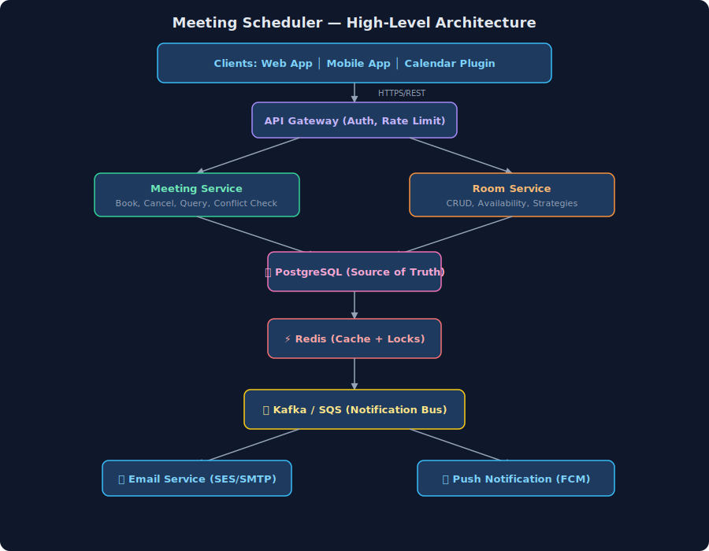
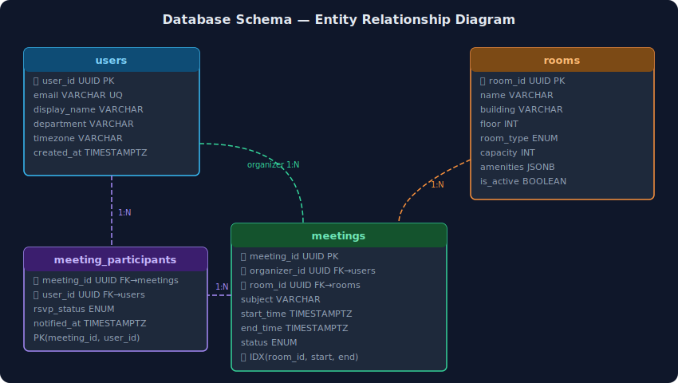
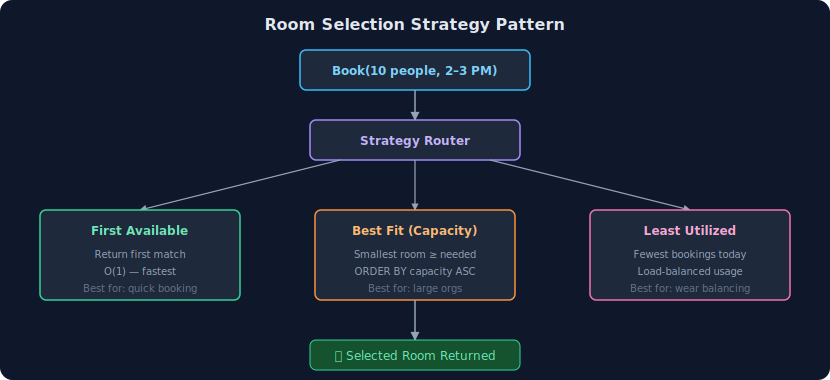
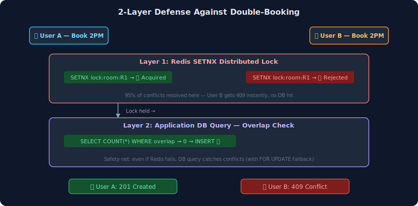
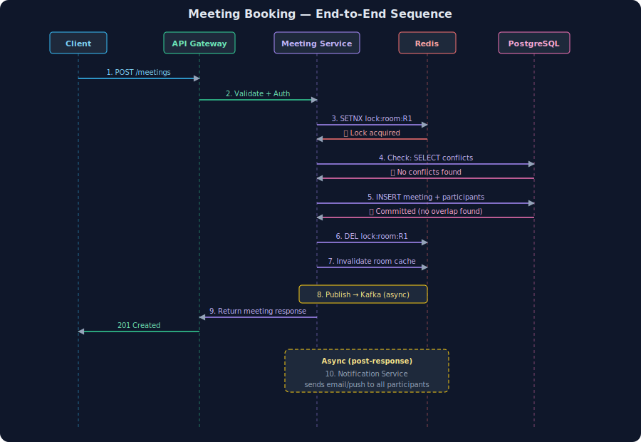

# Meeting Scheduler — High-Level System Design

---

## What is a Meeting Scheduler?

> A **Meeting Scheduler** is an enterprise collaboration tool that allows employees to book meeting rooms, invite participants, and manage meeting lifecycles. Think **Google Calendar + Room Booking** — Outlook, Calendly, or Robin Powered. The core challenge is **preventing double-bookings** while handling concurrent reservations across multiple rooms.

**Key Scale Numbers (Interview Context):**

| Metric | Value |
|---|---|
| Total Employees (Org) | ~50,000 |
| Meeting Rooms | ~2,000 across 20 offices |
| Meetings Booked/Day | ~30,000 |
| Peak Bookings/Minute | ~500 (Mon 9–10 AM) |
| Average Meeting Duration | 30–60 minutes |
| Concurrent Users | ~5,000 at peak |
| Availability SLA | 99.9% |

---

## 1. Functional Requirements

1. **Room Management** — Support multiple meeting rooms with different types (conference, board room, huddle space) and capacities
2. **Meeting Scheduling** — Schedule meetings with subject, organizer, participants, room, and time slot
3. **Conflict Detection** — Detect and reject scheduling conflicts when a room is already booked
4. **Room Selection Strategies** — Configurable strategies (first available, best fit by capacity)
5. **Meeting Cancellation** — Cancel scheduled meetings and free up the room
6. **Room Availability Query** — Query available rooms for a given time slot and required capacity
7. **Participant Notifications** — Notify participants when meetings are scheduled or cancelled
8. **Meeting Lifecycle** — Track meeting status (scheduled, cancelled, completed)

---

## 2. Non-Functional Requirements

| Requirement | Target |
|---|---|
| **Latency** | Room availability check < 100ms; Booking < 500ms |
| **Throughput** | 500 bookings/min at peak |
| **Availability** | 99.9% uptime |
| **Consistency** | **Strong consistency** for bookings — no double-booking ever |
| **Durability** | Zero booking loss — persisted before acknowledgment |
| **Scalability** | Handle 50K users, 2K rooms, 30K meetings/day |
| **Notification Latency** | Email/push within 5 seconds of booking |

---

## 3. High-Level Architecture

```
┌─────────────────────────────────────────────────────────────────┐
│                        Clients                                   │
│   Web App (React)   │   Mobile App   │   Outlook/Calendar Plugin │
└───────────────────────────┬──────────────────────────────────────┘
                            │ HTTPS / REST
                  ┌─────────▼──────────┐
                  │    API Gateway      │
                  │  (Rate Limit, Auth) │
                  └──────┬──────┬──────┘
             ┌───────────┘      └──────────────┐
  ┌──────────▼────────┐              ┌─────────▼──────────┐
  │  Meeting Service  │              │   Room Service      │
  │  (Book, Cancel,   │              │  (CRUD, Availability│
  │   Query)          │              │   Strategies)       │
  └────────┬──────────┘              └─────────┬──────────┘
           │                                    │
           │         ┌─────────────────┐        │
           └────────▶│   PostgreSQL    │◀───────┘
                     │  (Source of     │
                     │   Truth)        │
                     └───────┬─────────┘
                             │
                    ┌────────▼──────────┐
                    │   Redis Cache     │
                    │  (Room Avail.     │
                    │   + Locks)        │
                    └───────────────────┘
                             │
                   ┌─────────▼──────────┐
                   │   Kafka / SQS      │
                   │  (Notification Bus) │
                   └──────┬──────┬──────┘
                ┌─────────┘      └──────────┐
        ┌───────▼──────┐          ┌─────────▼────────┐
        │  Email Svc   │          │  Push Notification │
        │  (SES/SMTP)  │          │  (FCM/APNs)        │
        └──────────────┘          └──────────────────┘
```

### SVG — System Architecture Diagram



---

## 4. Database Design (PostgreSQL)

### Why PostgreSQL?

| Consideration | PostgreSQL (✅ Chosen) | MongoDB | MySQL |
|---|---|---|---|
| **ACID transactions** | Native, bullet-proof | Multi-doc txn (v4.0+), weaker | Yes, but fewer features |
| **Range queries on time** | Excellent with B-tree indexes | Good but less natural | Good |
| **Composite indexes** | Partial indexes, GIN for JSONB | Secondary indexes only | Yes, basic |
| **JSON support** | Native JSONB | Native | JSON type (limited) |
| **Mature ecosystem** | Extensions, pg_cron, partitioning | Flexible schema | Limited extensibility |
| **Connection pooling** | PgBouncer support | Built-in pooling | ProxySQL |

> **Why not MongoDB?** Meeting scheduling is inherently **relational** — rooms have bookings, bookings have participants, participants belong to organizations. PostgreSQL gives us strong ACID guarantees, and we handle conflict detection at the **application layer using Redis + DB queries**.

> **Why not Redis as primary store?** Redis is in-memory and lacks durable ACID transactions. We use it as a **cache + distributed lock layer**, not as the source of truth.

---

### Core Tables

#### `rooms`

```sql
CREATE TABLE rooms (
    room_id         UUID            PRIMARY KEY DEFAULT gen_random_uuid(),
    name            VARCHAR(100)    NOT NULL,
    building        VARCHAR(100)    NOT NULL,
    floor           INT             NOT NULL,
    room_type       VARCHAR(20)     NOT NULL CHECK (room_type IN ('conference', 'board_room', 'huddle_space')),
    capacity        INT             NOT NULL CHECK (capacity > 0),
    amenities       JSONB           DEFAULT '[]',       -- ["projector", "whiteboard", "video_conf"]
    is_active       BOOLEAN         DEFAULT TRUE,
    created_at      TIMESTAMPTZ     DEFAULT NOW(),
    updated_at      TIMESTAMPTZ     DEFAULT NOW()
);

-- Index for availability queries: "find rooms with capacity >= X of type Y"
CREATE INDEX idx_rooms_capacity_type ON rooms (capacity, room_type) WHERE is_active = TRUE;
```

> **Why JSONB for amenities?** Amenities are variable per room and queried with `@>` operator (`amenities @> '["projector"]'`). A separate `room_amenities` join table would add unnecessary complexity for a simple tag-like attribute.

---

#### `meetings`

```sql
CREATE TABLE meetings (
    meeting_id      UUID            PRIMARY KEY DEFAULT gen_random_uuid(),
    subject         VARCHAR(255)    NOT NULL,
    organizer_id    UUID            NOT NULL REFERENCES users(user_id),
    room_id         UUID            NOT NULL REFERENCES rooms(room_id),
    start_time      TIMESTAMPTZ     NOT NULL,
    end_time        TIMESTAMPTZ     NOT NULL,
    status          VARCHAR(20)     NOT NULL DEFAULT 'scheduled'
                                    CHECK (status IN ('scheduled', 'cancelled', 'completed')),
    recurrence_rule VARCHAR(100),   -- "FREQ=WEEKLY;BYDAY=MO,WE;COUNT=10"
    created_at      TIMESTAMPTZ     DEFAULT NOW(),
    updated_at      TIMESTAMPTZ     DEFAULT NOW(),

    -- Basic validation
    CONSTRAINT valid_time_range CHECK (end_time > start_time),
    CONSTRAINT valid_duration CHECK (end_time - start_time <= INTERVAL '8 hours')
);

-- Index for fast conflict-check queries: "is this room booked during this time?"
CREATE INDEX idx_meetings_room_time ON meetings (room_id, start_time, end_time)
    WHERE status = 'scheduled';

-- Index for user's meetings lookup
CREATE INDEX idx_meetings_organizer ON meetings (organizer_id, start_time);
```

> **Conflict detection is handled at the application layer** — Redis lock prevents concurrent access, and the app runs a DB query to check for overlaps before inserting. The `idx_meetings_room_time` index makes this check blazing fast (<1ms).

---

#### `meeting_participants`

```sql
CREATE TABLE meeting_participants (
    meeting_id      UUID            NOT NULL REFERENCES meetings(meeting_id) ON DELETE CASCADE,
    user_id         UUID            NOT NULL REFERENCES users(user_id),
    rsvp_status     VARCHAR(20)     DEFAULT 'pending'
                                    CHECK (rsvp_status IN ('pending', 'accepted', 'declined', 'tentative')),
    notified_at     TIMESTAMPTZ,
    PRIMARY KEY (meeting_id, user_id)
);

CREATE INDEX idx_participants_user ON meeting_participants (user_id);  -- "My meetings" query
```

---

#### `users`

```sql
CREATE TABLE users (
    user_id         UUID            PRIMARY KEY DEFAULT gen_random_uuid(),
    email           VARCHAR(255)    UNIQUE NOT NULL,
    display_name    VARCHAR(100)    NOT NULL,
    department      VARCHAR(100),
    timezone        VARCHAR(50)     DEFAULT 'UTC',
    created_at      TIMESTAMPTZ     DEFAULT NOW()
);
```

---

### SVG — ER Diagram



---

## 5. API Design

### 5.1 Schedule a Meeting

```
POST /api/v1/meetings
```

**Request Body:**
```json
{
    "subject": "Sprint Planning Q3",
    "organizer_id": "user_abc123",
    "room_id": "room_xyz789",
    "start_time": "2026-04-21T10:00:00+05:30",
    "end_time": "2026-04-21T11:00:00+05:30",
    "participant_ids": ["user_def456", "user_ghi789", "user_jkl012"],
    "recurrence_rule": null
}
```

**Response (201 Created):**
```json
{
    "meeting_id": "meet_a1b2c3d4",
    "subject": "Sprint Planning Q3",
    "room": {
        "room_id": "room_xyz789",
        "name": "Everest Conference Room",
        "floor": 3,
        "capacity": 12
    },
    "start_time": "2026-04-21T10:00:00+05:30",
    "end_time": "2026-04-21T11:00:00+05:30",
    "status": "scheduled",
    "participants": [
        { "user_id": "user_def456", "email": "alice@company.com", "rsvp": "pending" },
        { "user_id": "user_ghi789", "email": "bob@company.com", "rsvp": "pending" }
    ],
    "created_at": "2026-04-19T10:00:00Z"
}
```

**Error (409 Conflict — Room already booked):**
```json
{
    "error": "ROOM_CONFLICT",
    "message": "Room 'Everest Conference Room' is already booked from 10:00 to 11:30 by 'Design Review'",
    "conflicting_meeting_id": "meet_x9y8z7",
    "suggestion": {
        "available_rooms": [
            { "room_id": "room_alt001", "name": "K2 Huddle", "capacity": 8 },
            { "room_id": "room_alt002", "name": "Kangchenjunga Board Room", "capacity": 20 }
        ]
    }
}
```

---

### 5.2 Cancel a Meeting

```
DELETE /api/v1/meetings/{meeting_id}
```

**Response (200 OK):**
```json
{
    "meeting_id": "meet_a1b2c3d4",
    "status": "cancelled",
    "cancelled_by": "user_abc123",
    "cancelled_at": "2026-04-19T10:30:00Z",
    "notification_sent": true
}
```

> Only the **organizer** or an **admin** can cancel a meeting. Cancellation is a **soft delete** — `status` changes to `cancelled`, the room is freed, but the record is retained for audit.

---

### 5.3 Search Rooms (Step 1)

> **Design Choice:** We use a two-step booking flow. First, the user filters rooms by physical properties (capacity, type). Then, they select a room to view its schedule. This is faster and simpler than a complex monolithic query.

```
GET /api/v1/rooms?capacity=10&room_type=conference&amenities=projector
```

**Response (200 OK):**
```json
{
    "rooms": [
        {
            "room_id": "room_xyz789",
            "name": "Everest Conference Room",
            "building": "HQ Tower",
            "capacity": 12,
            "room_type": "conference",
            "amenities": ["projector", "whiteboard"]
        },
        {
            "room_id": "room_alt002",
            "name": "Kangchenjunga Board Room",
            "building": "HQ Tower",
            "capacity": 20,
            "room_type": "board_room",
            "amenities": ["projector", "video_conf"]
        }
    ],
    "total_count": 2
}
```

**SQL Query:**
```sql
SELECT * FROM rooms 
WHERE is_active = TRUE
  AND capacity >= 10
  AND room_type = 'conference'
  AND amenities @> '["projector"]'
ORDER BY capacity ASC;  -- Best fit first
```

---

### 5.4 Get Room Daily Schedule (Step 2)

> Once the user clicks "Everest Conference Room", the UI needs its daily schedule to paint the timeline view (blocked vs empty slots).

```
GET /api/v1/rooms/room_xyz789/schedule?date=2026-04-21
```

**Response (200 OK):**
```json
{
    "room_id": "room_xyz789",
    "date": "2026-04-21",
    "occupied_timeslots": [
        {
            "start_time": "2026-04-21T09:00:00+05:30",
            "end_time": "2026-04-21T10:00:00+05:30",
            "status": "scheduled"
        },
        {
            "start_time": "2026-04-21T14:00:00+05:30",
            "end_time": "2026-04-21T15:00:00+05:30",
            "status": "scheduled"
        }
    ]
}
```

**SQL Query:**
```sql
SELECT start_time, end_time, status
FROM meetings
WHERE room_id = 'room_xyz789'
  AND status = 'scheduled'
  AND start_time >= '2026-04-21T00:00:00+05:30'
  AND start_time < '2026-04-22T00:00:00+05:30'
ORDER BY start_time ASC;
```

> **UI Logic:** The frontend takes these `occupied_timeslots` and renders them as red blocks on the daily calendar. Any white space between them is inherently "available" for the user to click and book.

---

### 5.5 Get User's Meetings

```
GET /api/v1/users/{user_id}/meetings?date=2026-04-21&status=scheduled
```

---

### 5.6 Update RSVP

```
PATCH /api/v1/meetings/{meeting_id}/participants/{user_id}/rsvp
```

```json
{ "rsvp_status": "accepted" }
```

---

### Full API Summary

| Method | Endpoint | Description |
|---|---|---|
| `POST` | `/api/v1/meetings` | Schedule a new meeting |
| `GET` | `/api/v1/meetings/{id}` | Get meeting details |
| `DELETE` | `/api/v1/meetings/{id}` | Cancel a meeting |
| `GET` | `/api/v1/rooms/{id}/schedule` | Get room's daily schedule (occupied slots) |
| `GET` | `/api/v1/users/{id}/meetings` | Get user's meetings |
| `PATCH` | `/api/v1/meetings/{id}/participants/{uid}/rsvp` | Update RSVP |
| `POST` | `/api/v1/rooms` | Add a new room (admin) |
| `PUT` | `/api/v1/rooms/{id}` | Update room details (admin) |

---

## 6. Room Selection Strategies (Strategy Pattern)

> When the user requests "find me any available room for 10 people at 2 PM," the system needs a **strategy** to pick the best room. This is implemented using the **Strategy Pattern**.

### Strategy 1: First Available

Returns the **first room found** that matches capacity and time — fastest response, no optimization.

```
Room A (cap: 8)  → ❌ Too small
Room B (cap: 12) → ✅ Available → PICK THIS ONE (stop searching)
Room C (cap: 20) → Not checked
```

**Use case:** Simple orgs, huddle spaces, quick informal meetings.

### Strategy 2: Best Fit by Capacity

Returns the room with **smallest capacity ≥ required** — minimizes wasted space.

```
Need: 10 people

Room A (cap: 8)  → ❌ Too small
Room B (cap: 12) → ✅ Candidate (waste = 2)
Room C (cap: 20) → ✅ Candidate (waste = 10)
Room D (cap: 10) → ✅ Candidate (waste = 0) → PICK THIS ONE
```

**Use case:** Large orgs with many rooms — ensures big conference rooms aren't wasted on 3-person standups.

### Strategy 3: Least Utilized (Load Balancing)

Picks the room with the **fewest bookings today** — distributes wear and usage evenly.

```sql
SELECT r.room_id, r.name, COUNT(m.meeting_id) AS bookings_today
FROM rooms r
LEFT JOIN meetings m ON r.room_id = m.room_id
  AND m.start_time::date = CURRENT_DATE
  AND m.status = 'scheduled'
WHERE r.capacity >= 10
  AND NOT EXISTS (...)  -- no conflict
GROUP BY r.room_id
ORDER BY bookings_today ASC
LIMIT 1;
```

---

### SVG — Room Selection Strategy Flow



---

## 7. Deep Dive: Concurrency & Double-Booking Prevention

> **This is THE critical interview question.** Two users try to book the same room at the same time. How do you prevent double-booking?

### The Race Condition

```
Time     User A                          User B
────     ──────                          ──────
t=0      Check room availability         Check room availability
t=1      Room is free ✅                  Room is free ✅
t=2      INSERT meeting for 2-3 PM       INSERT meeting for 2-3 PM
t=3      ✅ Booked!                       ✅ Booked!  ← 🔴 DOUBLE BOOKING!
```

Both users checked availability **before** either committed. This is a classic **TOCTOU (Time-of-Check-to-Time-of-Use)** bug.

### Solution: 2-Layer Defense (Redis Lock + Application-Level DB Check)

We use a **simple, interview-friendly** approach with two layers:

---

### Layer 1: Redis Distributed Lock (Fast Gate)

Before checking availability, acquire a **lock on the room + time slot** using Redis `SETNX`:

```
LOCK KEY: lock:room:{room_id}:slot:{date}:{hour}
TTL: 5 seconds (auto-release if app crashes)
```

#### But Wait — How Does the Room Get Selected?

By the time we reach the Redis lock, **we already know which room** we're trying to book. There are two flows:

**Flow 1: User Picks the Room (Most Common)**
```
User opens app → sees list of rooms → picks "Everest" → clicks "Book 2-3 PM"
                                          │
                                          ▼
                        Lock key uses "Everest" because USER chose it
                        SETNX lock:room:Everest:slot:04-21:14
```
This is like booking a **specific seat** in a movie theater — "I want THIS room."

**Flow 2: System Auto-Assigns the Room**
```
User says: "I need ANY room for 10 people at 2 PM" → GET /rooms/available
                                                          │
                                                          ▼
                                            Room selection strategy runs
                                            (best-fit, first-available, etc.)
                                                          │
                                                          ▼
                                            Strategy returns: "Everest" (cap: 12)
                                                          │
                                                          ▼
                                            NOW lock "Everest"
                                            SETNX lock:room:Everest:slot:04-21:14
```
This is like telling Uber "take me to the airport" — the system picks the car for you.

> **Either way, the room is known BEFORE the lock.** The Redis lock doesn't decide which room — it just ensures only **one person at a time** can attempt to book that specific room at that specific hour.

#### Redis Key Breakdown

```
SETNX  lock : room : Everest : slot : 04-21 : 14
  │      │      │       │        │      │       │
  │      │      │       │        │      │       └── 14 = 2 PM (24hr format, the HOUR)
  │      │      │       │        │      └────────── 04-21 = April 21st (the DATE)
  │      │      │       │        └───────────────── "slot" = just a namespace separator
  │      │      │       └────────────────────────── "Everest" = the specific ROOM
  │      │      └─────────────────────────────────── "room" = resource type label
  │      └────────────────────────────────────────── "lock" = prefix (this is a lock key)
  └───────────────────────────────────────────────── SETNX = Redis command: "SET if Not eXists"
```

**What `SETNX` does:**
```
SETNX = SET + NX

SET  → store a key-value pair in Redis
NX   → only if the key does NOT already exist

User A:  SETNX lock:room:Everest:slot:04-21:14  "req_abc"
         → Key didn't exist → CREATED → returns 1 (success ✅)

User B:  SETNX lock:room:Everest:slot:04-21:14  "req_def"
         → Key ALREADY exists (User A created it) → returns 0 (fail ❌)
```

**The actual full Redis command:**
```
SET lock:room:Everest:slot:04-21:14 "req_abc" NX EX 5
                                                │   │
                                   NX = only if │   └── EX 5 = expire after 5 seconds
                                   not exists ──┘
```

#### Lock Granularity: Per Room, Per Hour

```
lock:room:Everest:slot:04-21:14   ← covers 2:00 PM hour window
lock:room:Everest:slot:04-21:15   ← covers 3:00 PM hour window (DIFFERENT lock!)
lock:room:K2:slot:04-21:14        ← covers 2:00 PM but different room (DIFFERENT lock!)
```

- User A booking **Everest 2-3 PM** and User B booking **K2 2-3 PM** → **different locks, no blocking**
- User A booking **Everest 2-3 PM** and User B booking **Everest 4-5 PM** → **different locks, no blocking**
- User A booking **Everest 2-3 PM** and User B booking **Everest 2-3 PM** → **SAME lock, User B blocked ❌**

```java
// Pseudocode
String lockKey = "lock:room:" + roomId + ":slot:" + date + ":" + hour;
boolean acquired = redis.set(lockKey, requestId, "NX", "EX", 5);

if (!acquired) {
    return 409; // "Room is being booked by another user, try again"
}

try {
    // Check availability in DB (Layer 2)
    // Insert meeting if available
    // Commit transaction
} finally {
    // Release lock (only if we still own it — Lua script for atomicity)
    redis.eval("if redis.call('get',KEYS[1]) == ARGV[1] then redis.call('del',KEYS[1]) end", lockKey, requestId);
}
```

> **Why Redis lock first?** It's **fast** (sub-ms) and prevents unnecessary DB round-trips for concurrent requests. 95% of conflicts are resolved here without hitting PostgreSQL.

#### What Redis Stores at Any Given Moment

Redis holds **only short-lived lock keys** — nothing permanent:

```
Redis snapshot:

lock:room:Everest:slot:2026-04-21:14    = "req_abc"   TTL: 4s remaining
lock:room:K2:slot:2026-04-21:15         = "req_def"   TTL: 3s remaining
lock:room:Everest:slot:2026-04-21:16    = "req_ghi"   TTL: 5s remaining

That's it. 3 keys. Each lives for max 5 seconds.
PostgreSQL has ALL the actual meeting data.
```

> **Think of Redis as a bouncer at a door.** The bouncer doesn't know everyone who's ever entered (that's the DB). The bouncer just ensures only **one person goes through the door at a time**. Once you're through, the bouncer lets the next person try — but they'll still need to check the guest list (DB) to see if a seat is available.

- TTL of 5 seconds ensures abandoned locks auto-expire (if app crashes mid-booking)
- The `requestId` value ensures only the lock owner can release it (prevents accidental unlock)

#### Why SETNX and Not Redlock?

| Approach | Complexity | When to use |
|---|---|---|
| **SETNX (single Redis)** | Simple | ✅ Single Redis instance, 99% of use cases |
| **Redlock (multi-node)** | Complex (quorum across 5 nodes) | Multi-region, extreme HA requirements |

> For a meeting scheduler, single-node Redis `SETNX` is more than enough. Redlock is overkill.

---

### Layer 2: Application-Level DB Conflict Check (Safety Net)

Even with the Redis lock, the application **always queries PostgreSQL** to verify no overlap before inserting. This is the **safety net** in case Redis goes down or the lock expires prematurely.

```sql
-- Step 1: Check for conflicts using an indexed query
SELECT COUNT(*) FROM meetings
WHERE room_id = 'room_xyz789'
  AND status = 'scheduled'
  AND start_time < '2026-04-21T11:00:00+05:30'   -- requested end
  AND end_time   > '2026-04-21T10:00:00+05:30';   -- requested start

-- Step 2: If COUNT = 0, insert the meeting
INSERT INTO meetings (meeting_id, subject, organizer_id, room_id, start_time, end_time, status)
VALUES (gen_random_uuid(), 'Sprint Planning', 'user_abc', 'room_xyz789',
        '2026-04-21T10:00:00+05:30', '2026-04-21T11:00:00+05:30', 'scheduled');
```

> **The overlap detection logic is simple:** Two time ranges overlap if and only if `start_A < end_B AND end_A > start_B`. This is a basic indexed query — no special Postgres features needed. Any interviewer can understand it instantly.

#### Does This Query Scan the Whole Table? NO.

The `idx_meetings_room_time` partial composite index does all the heavy lifting:

```sql
CREATE INDEX idx_meetings_room_time ON meetings (room_id, start_time, end_time)
    WHERE status = 'scheduled';
```

Here's what actually happens inside PostgreSQL:

```
Total meetings in DB:          7,500,000  (5 years of data)
After index filter (room_id):  ~3,750     (only THIS room's meetings)
After status = 'scheduled':    ~500       (partial index already excludes cancelled/completed)
After time range check:        ~2-3       (meetings near that hour)

Index lookup: O(log n) B-tree scan → sub-millisecond
```

> **Think of it like a phone book:** You don't read the entire book to find "Smith." You jump to 'S', then 'Sm', then 'Smi' — that's exactly what a B-tree index does. The query checks maybe **3-5 rows**, not 7.5 million.

#### Redis Lock vs DB Query — They Solve Different Problems

```
 Redis Lock                              DB Query
 ──────────                              ────────
 Solves: CONCURRENT conflicts            Solves: EXISTING booking conflicts
 "Two people clicking at the             "Someone booked this room
  exact same millisecond"                 yesterday for the same slot"

 Without Redis: Both hit DB              Without DB check: Redis only knows
 at same time, both see 0                about RIGHT-NOW conflicts, not
 conflicts, both INSERT → 💥             meetings booked hours ago → 💥

 Speed: ~0.5ms                           Speed: ~1-2ms (indexed)
 Blocks: 95% of conflicts                Catches: 100% of conflicts
```

> **You need BOTH.** Redis alone can't tell if a room was booked yesterday. The DB alone can't handle two requests arriving at the same millisecond.

#### Complete Java Pseudocode

```java
@Transactional
public Meeting scheduleMeeting(MeetingRequest request) {
    String lockKey = "lock:room:" + request.getRoomId() + ":slot:" + request.getDate() + ":" + request.getHour();
    String requestId = UUID.randomUUID().toString();

    // LAYER 1: Acquire Redis lock
    boolean locked = redis.set(lockKey, requestId, "NX", "EX", 5);
    if (!locked) {
        throw new ConflictException("Room is being booked by another user, try again");
    }

    try {
        // LAYER 2: Check DB for conflicts
        int conflicts = jdbcTemplate.queryForObject(
            "SELECT COUNT(*) FROM meetings WHERE room_id = ? AND status = 'scheduled' " +
            "AND start_time < ? AND end_time > ?",
            Integer.class,
            request.getRoomId(), request.getEndTime(), request.getStartTime()
        );

        if (conflicts > 0) {
            throw new ConflictException("Room is already booked for this time slot");
        }

        // Safe to insert — lock held + no conflicts in DB
        Meeting meeting = meetingRepository.save(new Meeting(request));
        participantRepository.saveAll(request.getParticipantIds(), meeting.getId());

        // Publish async event for notifications
        kafkaTemplate.send("meeting.events", new MeetingScheduledEvent(meeting));

        return meeting;
    } finally {
        // Release Redis lock (only if we still own it)
        redis.eval(
            "if redis.call('get',KEYS[1]) == ARGV[1] then redis.call('del',KEYS[1]) end",
            lockKey, requestId
        );
    }
}
```

---

### What Happens When Two Users Race?

```
Time     User A                                  User B
────     ──────                                  ──────
t=0      SETNX lock:room:R1:slot:04-21:14        SETNX lock:room:R1:slot:04-21:14
         → ✅ Lock acquired                       → ❌ Key exists — BLOCKED!
t=1      SELECT COUNT(*) → 0 (no conflicts)      Returns 409 Conflict immediately
t=2      INSERT meeting ✅
t=3      DEL lock (release)
         → Returns 201 Created
```

> **User B never even hits the database.** The Redis lock resolves the conflict in sub-millisecond. This is the beauty of the approach — it's fast, simple, and easy to explain in an interview.

### What If Redis Goes Down?

```
Time     User A                                  User B
────     ──────                                  ──────
t=0      Redis unavailable → skip lock           Redis unavailable → skip lock
t=1      SELECT COUNT(*) → 0 (no conflicts)      SELECT COUNT(*) → 0 (no conflicts)  ← 🔴 RACE!
t=2      INSERT meeting ✅                        INSERT meeting ✅ ← 🔴 DOUBLE BOOKING!
```

> **How to handle:** When Redis is down, fall back to **pessimistic locking** at the DB level:

```sql
BEGIN;

-- Lock the room row — blocks other transactions trying to book the same room
SELECT * FROM rooms WHERE room_id = 'room_xyz789' FOR UPDATE;

-- Now safe to check and insert
SELECT COUNT(*) FROM meetings
WHERE room_id = 'room_xyz789' AND status = 'scheduled'
  AND start_time < '2026-04-21T11:00' AND end_time > '2026-04-21T10:00';

-- If count = 0, insert
INSERT INTO meetings (...) VALUES (...);

COMMIT;
```

> **`SELECT ... FOR UPDATE`** locks the room row, forcing other transactions to **wait** until the first one commits. This is slower than Redis (~5ms vs ~1ms) but provides DB-level safety. Use this as a fallback only when Redis is unavailable.

---

### SVG — Concurrency Control Flow



---

### Comparison: Concurrency Control Approaches

| Approach | Mechanism | Latency | Complexity | Double-Book Risk |
|---|---|---|---|---|
| **Redis SETNX + DB Check** ✅ | Lock → query → insert | ~1ms lock + ~2ms query | ⭐ Simple | ✅ Extremely low |
| **SELECT FOR UPDATE** | Row-level pessimistic lock | ~5ms | Medium | ✅ Zero |
| **Optimistic Locking (version)** | Check version on commit | ~2ms | Medium | ⚠️ Retry storms at high contention |

> **Recommended approach: Redis Lock (fast gate) + Application DB query (conflict check) + SELECT FOR UPDATE (Redis-down fallback).** This is the simplest to explain, implement, and debug.

---

## 8. Booking Flow — Complete Sequence

### SVG — Booking Sequence Diagram



---

## 9. Notification System

> Notifications are **always async** — never block the booking response to send an email.

### Flow

```
Meeting Service
    │ publishes event
    ▼
Kafka Topic: meeting.events
    │
    ├── meeting.scheduled  →  Notify all participants: "You've been invited to..."
    ├── meeting.cancelled  →  Notify all participants: "Meeting cancelled..."
    ├── meeting.updated    →  Notify affected participants: "Time/room changed..."
    └── meeting.reminder   →  15 min before start: "Your meeting starts in 15 min"
```

### Notification Channels

| Event | Email | Push | In-App |
|---|---|---|---|
| Meeting Scheduled | ✅ (.ics attachment) | ✅ | ✅ |
| Meeting Cancelled | ✅ | ✅ | ✅ |
| Meeting Updated | ✅ | ✅ | ✅ |
| Reminder (15 min) | ❌ | ✅ | ✅ |
| RSVP Update | ❌ (organizer only) | ❌ | ✅ |

### Reminder Scheduling

Reminders are scheduled using a **delayed message queue** or a **cron job** that scans for upcoming meetings:

```sql
-- Cron runs every minute, finds meetings starting in 15 min
SELECT m.meeting_id, m.subject, m.start_time, mp.user_id
FROM meetings m
JOIN meeting_participants mp ON m.meeting_id = mp.meeting_id
WHERE m.status = 'scheduled'
  AND m.start_time BETWEEN NOW() + INTERVAL '14 minutes' AND NOW() + INTERVAL '15 minutes'
  AND mp.notified_at IS NULL;
```

> After sending, set `notified_at = NOW()` to prevent duplicate reminders.

---

## 10. Scale Discussion: Is This "Hard" to Scale?

> **Short answer: No.** A meeting scheduler is a **low-to-medium scale** system compared to something like Twitter or a stock exchange. Let's do the math.

### Scale Math

```
Users:                 50,000
Meetings booked/day:   30,000
Peak bookings/min:     500  (Monday 9-10 AM surge)
Peak bookings/sec:     ~8

Reads/sec (availability checks):  ~50 at peak
Writes/sec (bookings):            ~8 at peak

Database rows (meetings/year):    30,000 × 250 work days = 7.5 million
```

> **7.5 million rows/year is trivial for PostgreSQL.** A single Postgres instance with proper indexing handles 10,000+ queries/sec and billions of rows. This system does NOT need sharding, NoSQL, or distributed databases.

### Why PostgreSQL is More Than Enough

| Concern | Reality |
|---|---|
| **Write throughput** | 8 writes/sec at peak. Postgres handles 10,000+ writes/sec. We have **1,250× headroom**. |
| **Read throughput** | 50 reads/sec at peak. With indexes, Postgres handles 50,000+ reads/sec. **1,000× headroom**. |
| **Data volume** | 7.5M rows/year × 5 years = 37.5M rows. Postgres handles billions without breaking a sweat. |
| **Concurrent connections** | 5,000 users at peak. PgBouncer connection pool with 100 connections easily serves this. |

### When Would You Need to Scale?

| Scale Trigger | Threshold | Solution |
|---|---|---|
| > 100K employees | Connection pooling pressure | PgBouncer + Read Replicas |
| > 500 bookings/sec | Write contention on popular rooms | Redis lock + read replicas |
| > 50M meetings in DB | Query slowdowns on large tables | Table partitioning by month |
| Multi-region (global) | Cross-datacenter latency | Regional DB replicas + async sync |
| > 10M rooms (SaaS platform) | Tenant isolation | Schema-per-tenant or row-level security |

### Architecture at Different Scales

```
Small Org (1K users, 500 meetings/day):
┌──────────────┐
│  Monolith    │──→ PostgreSQL (single instance)
│  (Spring Boot)│
└──────────────┘
Cost: $50/month (1 server)


Medium Org (50K users, 30K meetings/day):    ← THIS IS OUR DESIGN
┌──────────────┐     ┌─────────────┐
│  API Servers │──→  │ PostgreSQL  │──→ Read Replica
│  (3 replicas)│     │ (Primary)   │
└──────┬───────┘     └─────────────┘
       │
    ┌──▼──┐     ┌───────┐
    │Redis│     │ Kafka │──→ Notification Service
    └─────┘     └───────┘
Cost: $300-500/month (managed services)


Enterprise SaaS (1M+ users, multi-tenant):
┌──────────────┐     ┌─────────────┐
│  API Gateway │     │ PostgreSQL  │──→ Read Replicas (3)
│  (Kong/Nginx)│     │ Citus Dist. │    + Connection Pooler (PgBouncer)
└──────┬───────┘     └─────────────┘
       │
  ┌────▼──────┐   ┌────────┐   ┌──────────┐
  │Meeting Svc│   │  Redis │   │  Kafka   │──→ Notification Microservice
  │(10 pods)  │   │Cluster │   │(3-broker)│    + Email / Push / SMS
  └───────────┘   └────────┘   └──────────┘
Cost: $2000-5000/month
```

---

## 11. Handling Edge Cases

### Recurring Meetings

```
User Books: "Weekly standup, Mon/Wed/Fri 10:00-10:15, next 12 weeks"
```

**Approach:** Expand recurrence rule into individual meeting records:

```sql
-- Generate 36 individual meetings (3 days × 12 weeks)
INSERT INTO meetings (subject, room_id, start_time, end_time, recurrence_group_id)
SELECT 'Daily Standup', 'room_001',
       gs::timestamptz,
       gs::timestamptz + INTERVAL '15 minutes',
       'recur_abc123'
FROM generate_series(
    '2026-04-21'::timestamptz,
    '2026-07-13'::timestamptz,
    '1 day'::interval
) gs
WHERE EXTRACT(DOW FROM gs) IN (1, 3, 5);  -- Mon, Wed, Fri
```

> **Why individual rows instead of a single "recurring" row?** Because each occurrence can be independently cancelled, moved, or have different participants. Storing them individually makes conflict detection trivial — the `EXCLUDE` constraint works naturally on each row.

### Time Zone Handling

```
User in IST books: "10:00 AM IST"
Stored in DB as:   "2026-04-21T04:30:00Z" (UTC)
Displayed to NYC user as: "12:30 AM ET"
```

> **Always store `TIMESTAMPTZ` in UTC.** Convert to user's timezone only at the API layer. PostgreSQL handles `AT TIME ZONE` conversions natively.

### Meeting Completion

A **cron job** runs every 5 minutes to mark past meetings as completed:

```sql
UPDATE meetings
SET status = 'completed', updated_at = NOW()
WHERE status = 'scheduled'
  AND end_time < NOW();
```

---

## 12. Technology Stack Summary

| Component | Technology | Reason |
|---|---|---|
| **API Gateway** | Nginx / Kong | Rate limiting, auth, SSL termination |
| **Backend** | Spring Boot (Java) or Go | Strong typing, great Postgres drivers, enterprise-ready |
| **Primary DB** | PostgreSQL | ACID, indexed range queries, proven at scale |
| **Cache + Locks** | Redis | Sub-ms distributed locks, room availability cache |
| **Message Bus** | Kafka / Amazon SQS | Async notification delivery, event sourcing |
| **Email** | AWS SES / SendGrid | .ics calendar attachments, reliable delivery |
| **Push Notifications** | Firebase Cloud Messaging | Cross-platform push |
| **Monitoring** | Prometheus + Grafana | Booking latency, conflict rate, room utilization dashboards |
| **Deployment** | Kubernetes (EKS) | Auto-scaling API pods based on traffic |

---

## 13. Common Interview Follow-up Questions

#### Q: What happens if Redis goes down and two users try to book?

**A:** We fall back to **`SELECT ... FOR UPDATE`** on the room row in PostgreSQL. This provides the same mutual exclusion as the Redis lock, but at the DB level. It's slower (~5ms vs ~1ms) because it involves a DB round-trip, but it guarantees no double-booking. The application detects Redis unavailability (via a health check or connection error) and switches to the pessimistic locking path automatically.

---

#### Q: How do you handle the "check then book" race condition without locks?

**A:** You **need some form of locking** — there's no safe lock-free approach for booking. Our strategy:
1. **Redis SETNX** — fastest option, blocks concurrent requests at the application layer
2. **SELECT ... FOR UPDATE** — pessimistic DB lock as fallback when Redis is down
3. **Application-level overlap query** — always runs as a validation step before INSERT

The Redis lock resolves 95% of conflicts without touching the DB. The remaining edge cases (Redis failure) are handled by pessimistic locking in PostgreSQL.

---

#### Q: Why not use MongoDB for flexible meeting schemas?

**A:** The data model is inherently **relational** — users ↔ meetings ↔ rooms ↔ participants all have well-defined relationships. PostgreSQL gives us ACID transactions (critical for booking), strong indexing (for fast overlap checks), and `SELECT ... FOR UPDATE` for pessimistic locking. MongoDB would require building all conflict detection in application code, which is more error-prone.

---

#### Q: How do you handle a thundering herd on Monday 9 AM?

**A:** Three strategies:
1. **Redis lock** gates concurrent bookings for the same room — only one proceeds, others get instant 409
2. **Connection pooling (PgBouncer)** — prevents 5,000 users from opening 5,000 DB connections
3. **Room availability cache in Redis** — pre-warmed cache for popular rooms reduces DB reads by 90%

---

#### Q: Would you shard this database?

**A:** **No.** At 30K meetings/day (7.5M/year), a single PostgreSQL instance with proper indexing is more than sufficient. Sharding adds enormous complexity (cross-shard queries, distributed transactions) for zero benefit at this scale. Partition by month (`PARTITION BY RANGE (start_time)`) if query performance degrades after 3+ years of data, but don't shard.

---

#### Q: How do you ensure notifications aren't sent twice?

**A:** Each notification event in Kafka has a unique `event_id`. The notification service maintains an idempotency table:
```sql
INSERT INTO sent_notifications (event_id, user_id, channel)
VALUES ($1, $2, $3)
ON CONFLICT DO NOTHING;
```
If the insert succeeds (no conflict), send the notification. If it conflicts, the notification was already sent — skip it.
