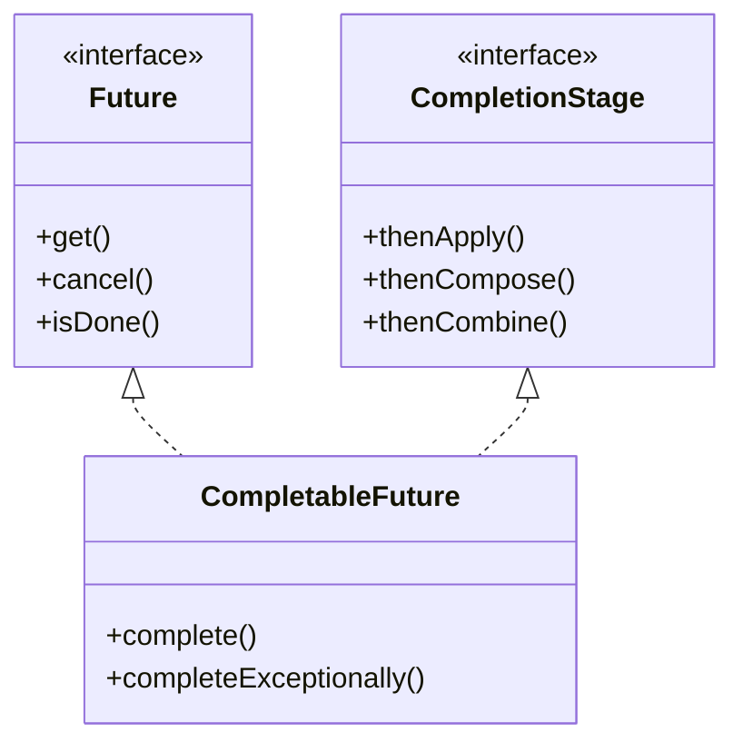

# Java Concurrency — ThreadPoolExecutor & CompletableFuture

---

## 1. ThreadPoolExecutor

`ThreadPoolExecutor` is the most powerful and configurable thread pool implementation in Java (`java.util.concurrent`). All the convenience pools created via `Executors` factory methods (`newFixedThreadPool`, `newCachedThreadPool`, etc.) ultimately delegate to a `ThreadPoolExecutor` under the hood.

### 1.1 Why Do We Need a Thread Pool?

- **Thread creation is expensive** — each thread allocates a stack (~512 KB–1 MB) and involves a kernel call.
- Without pooling, a burst of 10 000 requests would spawn 10 000 threads, causing massive context-switching overhead and possible `OutOfMemoryError`.
- A thread pool **reuses** a fixed set of threads, queues excess work, and applies back-pressure when the system is overloaded.

### 1.2 Constructor Parameters

```java
public ThreadPoolExecutor(
    int corePoolSize,
    int maximumPoolSize,
    long keepAliveTime,
    TimeUnit unit,
    BlockingQueue<Runnable> workQueue,
    ThreadFactory threadFactory,
    RejectedExecutionHandler handler
)
```

| Parameter | What It Does |
|---|---|
| **corePoolSize** | Minimum number of threads kept alive in the pool (even if idle), unless `allowCoreThreadTimeOut(true)` is set. |
| **maximumPoolSize** | Upper cap on threads. Extra threads beyond `corePoolSize` are created only when the **queue is full**. |
| **keepAliveTime + unit** | How long an idle thread **above** `corePoolSize` waits before being terminated. |
| **workQueue** | A `BlockingQueue<Runnable>` that holds tasks waiting to be executed. Choice of queue heavily influences pool behaviour. |
| **threadFactory** | Factory for creating new threads (lets you set names, daemon status, priority, etc.). |
| **handler** | The `RejectedExecutionHandler` invoked when both the queue and maximum threads are exhausted. |

### 1.3 How Task Submission Works (Internal Flow)

```
          submit(task)
              │
              ▼
   ┌──────────────────────┐
   │ activeThreads < core?│──YES──▶ Create new core thread, run task
   └──────────────────────┘
              │ NO
              ▼
   ┌──────────────────────┐
   │   Queue has space?   │──YES──▶ Enqueue task (a free thread will pick it up)
   └──────────────────────┘
              │ NO
              ▼
   ┌──────────────────────────────┐
   │ activeThreads < maxPoolSize? │──YES──▶ Create new non-core thread, run task
   └──────────────────────────────┘
              │ NO
              ▼
     RejectedExecutionHandler
        is invoked ✋
```

> **Key insight:** A new thread beyond `corePoolSize` is **only** created when the queue is already full. If you use an **unbounded** queue (e.g., `LinkedBlockingQueue()` with no capacity), `maximumPoolSize` is effectively ignored because the queue never fills up.

### 1.4 Common Queue Choices

| Queue Type | Behaviour | Best For |
|---|---|---|
| `SynchronousQueue` | Zero capacity — every put must be matched by a take. Forces thread creation up to `maxPoolSize`. | `CachedThreadPool`-style pools where you want fast hand-off. |
| `LinkedBlockingQueue(capacity)` | Bounded FIFO. Tasks queue up, and once full, new threads are created up to `maxPoolSize`. | General-purpose bounded pools. |
| `LinkedBlockingQueue()` (unbounded) | Unlimited capacity. `maxPoolSize` is effectively meaningless because the queue never fills. | `FixedThreadPool`. Risk of OOM if producers are faster than consumers. |
| `ArrayBlockingQueue(capacity)` | Bounded, backed by an array. Slightly better cache locality than `LinkedBlockingQueue`. | When you want a bounded queue with predictable memory footprint. |
| `PriorityBlockingQueue` | Unbounded, orders tasks by priority (natural order or `Comparator`). | When some tasks are more urgent than others. |

### 1.5 Pre-built Pools via `Executors` Factory

| Factory Method | corePoolSize | maxPoolSize | keepAlive | Queue | Notes |
|---|---|---|---|---|---|
| `newFixedThreadPool(n)` | n | n | 0 | Unbounded `LinkedBlockingQueue` | Fixed number of threads; tasks queue indefinitely. |
| `newCachedThreadPool()` | 0 | `Integer.MAX_VALUE` | 60 s | `SynchronousQueue` | Creates threads on demand, reuses idle ones. Can explode under load. |
| `newSingleThreadExecutor()` | 1 | 1 | 0 | Unbounded `LinkedBlockingQueue` | Guarantees sequential execution. |
| `newScheduledThreadPool(n)` | n | `Integer.MAX_VALUE` | 10 ms | `DelayedWorkQueue` | For delayed / periodic tasks. |

> ⚠️ **Production tip:** Prefer constructing `ThreadPoolExecutor` directly with bounded queues and explicit rejection handlers instead of using `Executors` factory methods — the defaults can lead to memory exhaustion.

---

## 2. Rejection Handlers (When the Queue Is Full)

When **both** the work queue is full **and** the number of threads has reached `maximumPoolSize`, the pool can't accept any more tasks. At this point, the `RejectedExecutionHandler` kicks in.

Java provides **4 built-in** policies:

### 2.1 `AbortPolicy` *(default)*

```java
new ThreadPoolExecutor.AbortPolicy()
```

- **Behaviour:** Throws a `RejectedExecutionException` immediately.
- **Use when:** You want the caller to know right away that the system is overloaded and handle the failure explicitly.
- **Example scenario:** An API server that should return HTTP 503 (Service Unavailable) when overwhelmed rather than silently dropping requests.

### 2.2 `CallerRunsPolicy`

```java
new ThreadPoolExecutor.CallerRunsPolicy()
```

- **Behaviour:** The **calling thread** (the one that submitted the task) executes the task itself, effectively slowing down the producer.
- **Use when:** You want natural back-pressure — the producer slows down because it's busy executing the task.
- **Example scenario:** A message-processing pipeline where slowing down the ingestion thread is preferable to losing messages.

> 💡 This is the most commonly recommended policy for production systems because it provides **graceful degradation** without data loss.

### 2.3 `DiscardPolicy`

```java
new ThreadPoolExecutor.DiscardPolicy()
```

- **Behaviour:** Silently drops the rejected task. No exception, no log, nothing.
- **Use when:** The task is non-critical and losing it is acceptable (e.g., optional metrics/telemetry).
- **Example scenario:** Fire-and-forget analytics events where occasional loss is fine.

### 2.4 `DiscardOldestPolicy`

```java
new ThreadPoolExecutor.DiscardOldestPolicy()
```

- **Behaviour:** Drops the **oldest** task waiting in the queue (the head), then retries submitting the new task.
- **Use when:** The latest data is more valuable than older data.
- **Example scenario:** A live stock-price display — showing an old price is worse than showing the latest one, so discard stale updates.

### 2.5 Custom Handler

You can write your own by implementing `RejectedExecutionHandler`:

```java
public class LogAndDiscardPolicy implements RejectedExecutionHandler {
    private static final Logger log = LoggerFactory.getLogger(LogAndDiscardPolicy.class);

    @Override
    public void rejectedExecution(Runnable r, ThreadPoolExecutor executor) {
        log.warn("Task {} rejected. Queue size: {}, Active threads: {}",
                  r, executor.getQueue().size(), executor.getActiveCount());
        // optionally: persist to a dead-letter queue, emit a metric, etc.
    }
}
```

### 2.6 Rejection Handlers Comparison

| Policy | Throws Exception? | Task Lost? | Back-Pressure? | Best For |
|---|---|---|---|---|
| **AbortPolicy** | ✅ Yes | ✅ Yes | ❌ No (caller must handle) | Fail-fast systems |
| **CallerRunsPolicy** | ❌ No | ❌ No | ✅ Yes (caller blocks) | Graceful degradation |
| **DiscardPolicy** | ❌ No | ✅ Yes | ❌ No | Non-critical fire-and-forget |
| **DiscardOldestPolicy** | ❌ No | ✅ Yes (oldest) | ❌ No | Latest-value-wins scenarios |
| **Custom** | Your choice | Your choice | Your choice | Logging, DLQ, metrics |

---

## 3. CompletableFuture

`CompletableFuture<T>` (Java 8+) is Java's answer to **composable, non-blocking asynchronous programming**. It implements both `Future<T>` and `CompletionStage<T>`.

### 3.1 Future vs CompletableFuture: Deep Dive Comparison

While both `Future` and `CompletableFuture` represent the result of an asynchronous computation, they represent two different paradigms in Java concurrency.

#### 3.1.1 The Class/Interface Hierarchy
- **`Future<T>`** (introduced in Java 5): A read-only handle to an asynchronous task that will eventually complete. It provides no callback mechanisms.
- **`CompletableFuture<T>`** (introduced in Java 8): Implements both **`Future<T>`** and **`CompletionStage<T>`**. This allows it to act as a reactive/event-driven promise, where you can attach callbacks and chain stages.



#### 3.1.2 Key Architectural Differences

##### 1. Blocking vs. Non-blocking Callback Paradigm
- **`Future<T>`**: The calling thread must block using `.get()` or poll using a loop with `.isDone()` and `Thread.sleep()` to wait for the result. This causes thread starvation, blocking valuable runtime/worker threads (e.g. Tomcat/HTTP request threads).
- **`CompletableFuture<T>`**: Push-based callback model. You register a callback (e.g., `.thenAccept()`) which is automatically executed once the result is ready. The calling thread is never blocked.

```java
// --- THE OLD FUTURE WAY (Blocking & Synchronous-wait) ---
Future<String> future = executorService.submit(() -> fetchUser(id));
// Calling thread blocks here until fetchUser finishes!
String user = future.get(); 
System.out.println("User: " + user);

// --- THE NEW COMPLETABLEFUTURE WAY (Non-blocking & Callback-driven) ---
CompletableFuture.supplyAsync(() -> fetchUser(id))
    .thenAccept(user -> System.out.println("User: " + user)); // Non-blocking callback
```

##### 2. Piping & Chaining (No Callback Hell)
- **`Future<T>`**: If Task B depends on the output of Task A, you must call `futureA.get()` (blocking), retrieve the result, and then submit Task B.
- **`CompletableFuture<T>`**: Supports fluent pipelining via `thenApply` (mapping) and `thenCompose` (flat-mapping).

```java
// Future: Requires blocking step-by-step
String rawData = futureA.get(); // Blocks
String processed = process(rawData);
Future<Result> futureB = executor.submit(() -> save(processed));
Result res = futureB.get(); // Blocks again

// CompletableFuture: Fluent chaining
CompletableFuture<Result> pipeline = CompletableFuture.supplyAsync(() -> fetchData())
    .thenApply(data -> process(data))             // synchronous transform
    .thenCompose(processed -> saveAsync(processed)); // dependent async step
```

##### 3. Coordination & Aggregation
- **`Future<T>`**: If you run multiple tasks in parallel and want to wait for all of them or the first one, you must manually iterate, poll, or block on each.
- **`CompletableFuture<T>`**: Provides declarative combinations like `allOf` (join all) and `anyOf` (race to the first).

##### 4. Manual Completion
- **`Future<T>`**: It is completely read-only. The JVM controls when it completes. You cannot manually set a value.
- **`CompletableFuture<T>`**: Can be manually completed by any thread. This is extremely useful for bridging legacy callback APIs or event-driven message architectures.

```java
CompletableFuture<String> promise = new CompletableFuture<>();

// Some message-listener thread gets a message
eventBus.onMessage(msg -> {
    promise.complete(msg.payload); 
});

// A caller can wait for it or chain callbacks
promise.thenAccept(payload -> System.out.println("Received: " + payload));
```

##### 5. Declarative Exception Handling
- **`Future<T>`**: Exceptions thrown inside the worker are wrapped in `ExecutionException` and re-thrown when you call `.get()`. You must handle them inside a standard `try-catch` block around `.get()`.
- **`CompletableFuture<T>`**: Allows functional error recovery inline via `.exceptionally()`, `.handle()`, and `.whenComplete()`.

---

#### 3.1.3 Feature Comparison Matrix

| Feature | `Future<T>` | `CompletableFuture<T>` |
|---|---|---|
| **Origin** | Java 5 | Java 8 |
| **Paradigm** | Pull-based (Blocking / Polling) | Push-based (Reactive / Callback-driven) |
| **Non-blocking Callbacks** | ❌ Not supported | ✅ Supported (`thenApply`, `thenAccept`, etc.) |
| **Manual Completion** | ❌ Not possible | ✅ Possible (`complete()`, `completeExceptionally()`) |
| **Fluent Pipelining** | ❌ Not possible | ✅ Possible (`thenCompose`, `thenApply`) |
| **Exception Handling** | ❌ Manual try-catch around `get()` | ✅ Built-in functional pipelines (`exceptionally`, `handle`) |
| **Multi-Future Coordination** | ❌ Requires manual boilerplate | ✅ Declarative static helpers (`allOf`, `anyOf`, `thenCombine`) |

> [!TIP]
> For CPU-bound operations, sharing the default `ForkJoinPool.commonPool()` is acceptable. However, for **I/O-bound** operations (e.g., calling remote APIs or querying DBs), always pass a custom thread pool/executor to `CompletableFuture` async methods (e.g., `supplyAsync(task, myCustomExecutor)`) to avoid starving CPU threads.


### 3.2 Creating a CompletableFuture

```java
// 1. Run an async task that RETURNS a value
CompletableFuture<String> cf1 = CompletableFuture.supplyAsync(() -> {
    return fetchDataFromDB();  // runs on ForkJoinPool.commonPool()
});

// 2. Run an async task that returns NOTHING
CompletableFuture<Void> cf2 = CompletableFuture.runAsync(() -> {
    sendNotification();
});

// 3. With a CUSTOM executor (recommended for I/O-bound work)
ExecutorService ioPool = Executors.newFixedThreadPool(10);
CompletableFuture<String> cf3 = CompletableFuture.supplyAsync(() -> {
    return callExternalApi();
}, ioPool);

// 4. Already-completed future (useful for testing or default values)
CompletableFuture<String> cf4 = CompletableFuture.completedFuture("default");
```

> ⚠️ By default, `supplyAsync` / `runAsync` use `ForkJoinPool.commonPool()`, which has `(Runtime.availableProcessors() - 1)` threads. This pool is **shared across the entire JVM** — always pass a custom executor for I/O-bound or long-running tasks to avoid starving other work.

### 3.3 Chaining & Transforming

#### `thenApply` — Transform the result (like `.map()`)

```java
CompletableFuture<Integer> lengthFuture = CompletableFuture
    .supplyAsync(() -> "Hello World")
    .thenApply(s -> s.length());  // 11
```

- Input: `T` → Output: `U`
- Runs **synchronously** on the thread that completed the previous stage (or the calling thread if already done).
- Use `thenApplyAsync()` to run on a different thread.

#### `thenAccept` — Consume the result (like `.forEach()`)

```java
CompletableFuture.supplyAsync(() -> fetchOrder(orderId))
    .thenAccept(order -> log.info("Order fetched: {}", order));
```

- Input: `T` → Output: `Void`

#### `thenRun` — Run an action (ignores the result)

```java
CompletableFuture.supplyAsync(() -> saveToDb(data))
    .thenRun(() -> log.info("Save completed"));
```

- Input: nothing → Output: `Void`

#### `thenCompose` — Flat-map (chain dependent async calls)

```java
CompletableFuture<Order> orderFuture = CompletableFuture
    .supplyAsync(() -> getUserId(token))
    .thenCompose(userId -> CompletableFuture.supplyAsync(() -> getOrder(userId)));
```

- Use when the next stage itself returns a `CompletableFuture` — avoids `CompletableFuture<CompletableFuture<T>>`.
- **`thenApply` vs `thenCompose`** = `map` vs `flatMap` in streams.

### 3.4 Combining Multiple Futures

#### `thenCombine` — Combine two independent futures

```java
CompletableFuture<String> nameFuture  = CompletableFuture.supplyAsync(() -> fetchName(userId));
CompletableFuture<String> emailFuture = CompletableFuture.supplyAsync(() -> fetchEmail(userId));

CompletableFuture<String> combined = nameFuture.thenCombine(emailFuture,
    (name, email) -> name + " <" + email + ">");
```

#### `allOf` — Wait for ALL futures to complete

```java
CompletableFuture<Void> all = CompletableFuture.allOf(cf1, cf2, cf3);
all.thenRun(() -> {
    // all three are done — safe to call .join()
    String r1 = cf1.join();
    String r2 = cf2.join();
    String r3 = cf3.join();
});
```

- Returns `CompletableFuture<Void>` — you need to extract individual results via `join()`.

#### `anyOf` — Wait for the FIRST future to complete

```java
CompletableFuture<Object> fastest = CompletableFuture.anyOf(cf1, cf2, cf3);
fastest.thenAccept(result -> log.info("First result: {}", result));
```

- Returns `CompletableFuture<Object>` — result type is erased.

### 3.5 Exception Handling

#### `exceptionally` — Recover from exceptions

```java
CompletableFuture<String> safe = CompletableFuture
    .supplyAsync(() -> riskyOperation())
    .exceptionally(ex -> {
        log.error("Failed", ex);
        return "fallback-value";
    });
```

- Only invoked if the previous stage **throws**.

#### `handle` — Process result OR exception

```java
CompletableFuture<String> handled = CompletableFuture
    .supplyAsync(() -> riskyOperation())
    .handle((result, ex) -> {
        if (ex != null) {
            log.error("Error", ex);
            return "fallback";
        }
        return result.toUpperCase();
    });
```

- Always invoked, regardless of success or failure. Exactly **one** of `result` or `ex` is non-null.

#### `whenComplete` — Side-effect on completion (doesn't alter the result)

```java
CompletableFuture<String> logged = CompletableFuture
    .supplyAsync(() -> riskyOperation())
    .whenComplete((result, ex) -> {
        if (ex != null) log.error("Failed", ex);
        else log.info("Succeeded: {}", result);
    });
// The original result (or exception) is propagated unchanged.
```

### 3.6 Async Variants

Almost every method has three variants:

| Variant | Thread Used |
|---|---|
| `thenApply(fn)` | Same thread that completed the previous stage |
| `thenApplyAsync(fn)` | A thread from `ForkJoinPool.commonPool()` |
| `thenApplyAsync(fn, executor)` | A thread from the **specified** executor |

Use the `Async` variant when the callback is CPU-intensive or I/O-bound and you don't want to block the completing thread.

### 3.7 `join()` vs `get()`

| Method | Checked Exception? | Wrapping |
|---|---|---|
| `get()` | ✅ `InterruptedException`, `ExecutionException` | Wraps in `ExecutionException` |
| `join()` | ❌ Unchecked | Wraps in `CompletionException` |

Prefer `join()` in lambda chains because it doesn't force you to catch checked exceptions.

### 3.8 Real-World Example — Parallel API Aggregation

```java
ExecutorService ioPool = Executors.newFixedThreadPool(5);

CompletableFuture<UserProfile> profileFuture =
    CompletableFuture.supplyAsync(() -> userService.getProfile(userId), ioPool);

CompletableFuture<List<Order>> ordersFuture =
    CompletableFuture.supplyAsync(() -> orderService.getOrders(userId), ioPool);

CompletableFuture<WalletBalance> walletFuture =
    CompletableFuture.supplyAsync(() -> walletService.getBalance(userId), ioPool);

CompletableFuture<UserDashboard> dashboard = CompletableFuture
    .allOf(profileFuture, ordersFuture, walletFuture)
    .thenApply(ignored -> new UserDashboard(
        profileFuture.join(),
        ordersFuture.join(),
        walletFuture.join()
    ))
    .exceptionally(ex -> {
        log.error("Dashboard aggregation failed", ex);
        return UserDashboard.empty();
    });
```

All three API calls run **in parallel**. Once all complete, the results are composed into a single `UserDashboard`. If any fails, a fallback is returned.

---

## 4. Quick Reference Cheat Sheet

```
ThreadPoolExecutor Lifecycle
─────────────────────────────
RUNNING  →  SHUTDOWN  →  TIDYING  →  TERMINATED
              (no new      (queue      (terminated()
               tasks)      empty,       hook runs)
                           all tasks
                           finished)

shutdown()        — graceful; finishes queued tasks, rejects new ones
shutdownNow()     — aggressive; interrupts running tasks, drains queue
awaitTermination()— blocks until terminated or timeout

CompletableFuture Pipeline
──────────────────────────
supplyAsync(fn)              — start
  .thenApply(fn)             — transform    T → U
  .thenCompose(fn)           — flat-map     T → CF<U>
  .thenCombine(other, fn)    — merge        (T, U) → V
  .thenAccept(fn)            — consume      T → void
  .exceptionally(fn)         — recover      Throwable → T
  .handle((r, ex) -> ...)    — handle both
  .whenComplete((r, ex) -> …)— side-effect
  .join()                    — block & get result
```

---

# Java Memory Model, Garbage Collection & GC Tuning (Java 8)

---

## 5. JVM Memory Architecture

### Memory Spaces at a Glance

- **JVM Process Memory**
  - **Heap** (shared across all threads — GC managed)
    - **Young Generation**
      - Eden Space — where `new` objects are born
      - Survivor S0 — ping-pong buffer A
      - Survivor S1 — ping-pong buffer B
    - **Old Generation (Tenured)** — long-lived promoted objects
  - **Non-Heap**
    - **Metaspace** — class metadata, constant pool, annotations (native memory, replaced PermGen in Java 8)
    - **Code Cache** — JIT-compiled native machine code
  - **Per-Thread**
    - **Thread Stack** — stack frames, local variables, method call chain (one per thread)
  - **Native / Off-Heap**
    - **Direct ByteBuffers** — NIO direct memory (`ByteBuffer.allocateDirect()`)
    - **JNI Memory** — memory allocated by native libraries
    - **GC Internal Structures** — card tables, remembered sets, marking bitmaps

When you start a Java application, the JVM carves out a chunk of OS memory and divides it into distinct regions. Understanding these regions is the foundation for GC tuning.

```
┌──────────────────────────────────────────────────────────────────────┐
│                         JVM Process Memory                          │
├──────────────────────────────────────────────────────────────────────┤
│                                                                      │
│  ┌────────────────────── HEAP (shared) ──────────────────────────┐   │
│  │                                                                │   │
│  │  ┌─────────────────── Young Generation ──────────────────┐    │   │
│  │  │                                                        │    │   │
│  │  │  ┌──────────┐  ┌──────────┐  ┌──────────┐            │    │   │
│  │  │  │   Eden   │  │ Survivor │  │ Survivor │            │    │   │
│  │  │  │  Space   │  │   S0     │  │   S1     │            │    │   │
│  │  │  └──────────┘  └──────────┘  └──────────┘            │    │   │
│  │  └────────────────────────────────────────────────────────┘    │   │
│  │                                                                │   │
│  │  ┌─────────────────── Old Generation ────────────────────┐    │   │
│  │  │              (Tenured Space)                           │    │   │
│  │  └────────────────────────────────────────────────────────┘    │   │
│  │                                                                │   │
│  └────────────────────────────────────────────────────────────────┘   │
│                                                                      │
│  ┌────────────── NON-HEAP (Metaspace) ───────────────────────────┐   │
│  │  Class metadata, method bytecode, constant pool, annotations  │   │
│  │  (Uses native memory — no fixed upper limit by default)       │   │
│  └────────────────────────────────────────────────────────────────┘   │
│                                                                      │
│  ┌─── Thread Stacks ───┐  ┌─── Code Cache ───┐  ┌─── Direct ───┐   │
│  │ One stack per thread │  │  JIT compiled     │  │  ByteBuffers │   │
│  │ (local vars, frames) │  │  native code      │  │  (NIO)       │   │
│  └──────────────────────┘  └──────────────────┘  └──────────────┘   │
│                                                                      │
└──────────────────────────────────────────────────────────────────────┘
```

### 5.1 Heap Memory (Shared Across All Threads)

The heap is where **all object instances** live. It is the primary target of garbage collection.

#### Young Generation (Minor GC target)

| Region | Purpose |
|---|---|
| **Eden Space** | Where **all new objects** are allocated (`new Object()`). Most objects die here (short-lived temporaries, local variables, intermediate results). |
| **Survivor S0 & S1** | Two equal-sized spaces that act as a **ping-pong buffer**. After a Minor GC, surviving objects from Eden + the current active Survivor are copied to the other Survivor. Only one Survivor is active at a time; the other is always empty. |

**Why two Survivor spaces?** This is the **copying collector** design. Instead of marking dead objects and compacting, you simply copy live objects to the empty survivor and wipe everything else. This avoids fragmentation and is extremely fast because most objects (~95%+) in Eden are dead by the time Minor GC runs.

#### Old Generation (Tenured Space — Major/Full GC target)

Objects that survive enough Minor GC cycles (controlled by `-XX:MaxTenuringThreshold`, default 15) get **promoted** (tenured) to the Old Generation. This space holds long-lived objects: caches, connection pools, singleton beans, session data, etc.

Old Gen GC is expensive because these objects are tightly packed and have many references to each other.

#### Object Promotion Flow

```
new Object()
     │
     ▼
  ┌──────┐    survives GC     ┌──────────┐    survives GC    ┌──────────┐
  │ Eden │ ─────────────────► │ Survivor │ ──────────────────► │ Survivor │
  └──────┘   (Minor GC)      │   (S0)   │    (Minor GC)     │   (S1)   │
                               └──────────┘                    └──────────┘
                                                                    │
                                                     age >= threshold
                                                     OR survivor full
                                                                    │
                                                                    ▼
                                                            ┌────────────┐
                                                            │  Old Gen   │
                                                            │ (Tenured)  │
                                                            └────────────┘
```

### 5.2 Non-Heap: Metaspace (Java 8+)

In Java 7 and earlier, class metadata lived in a fixed-size **PermGen** (Permanent Generation) inside the heap. This was a constant source of `java.lang.OutOfMemoryError: PermGen space` in applications that loaded many classes (e.g., app servers with hot-deploy, heavy reflection, dynamic proxies).

**Java 8 replaced PermGen with Metaspace:**

| Property | PermGen (Java 7) | Metaspace (Java 8+) |
|---|---|---|
| **Location** | Inside the JVM heap | Native memory (OS) |
| **Default size** | Fixed (64–256 MB) | Grows dynamically, limited only by OS |
| **OOM risk** | Very common | Rare (but can still happen if classloaders leak) |
| **Tuning flag** | `-XX:MaxPermSize` | `-XX:MaxMetaspaceSize` |

**What lives in Metaspace:**
- Class metadata (field names, method signatures, bytecode)
- Constant pool
- Annotations
- Method counters (used by JIT)

### 5.3 Thread Stacks

Each thread gets its own stack. The stack stores:
- **Stack frames** — one per method invocation (local variables, operand stack, return address)
- **Primitive local variables** — `int`, `long`, `boolean`, etc. live directly on the stack
- **Object references** — the reference (pointer) is on the stack; the actual object is on the heap

| Flag | Default | What It Does |
|---|---|---|
| `-Xss` | 512 KB – 1 MB (platform dependent) | Stack size per thread |

> ⚠️ If you have 500 threads × 1 MB stack = 500 MB just for stacks, **outside** the heap. This matters for container memory limits.

### 5.4 Code Cache

Stores JIT-compiled native code. When the JIT compiler (C1/C2) compiles hot bytecode methods into machine code, the result is stored here.

| Flag | Default | What It Does |
|---|---|---|
| `-XX:ReservedCodeCacheSize` | 240 MB (Java 8 tiered) | Max code cache size |

If the code cache fills up, JIT compilation stops and performance degrades silently.

### 5.5 Direct Memory (Off-Heap)

Used by `java.nio.ByteBuffer.allocateDirect()`. NIO channels, Netty, Kafka, and Cassandra drivers use this heavily. Allocated via `Unsafe.allocateMemory()` — not subject to GC but freed when the `ByteBuffer` object on the heap is collected.

| Flag | Default | What It Does |
|---|---|---|
| `-XX:MaxDirectMemorySize` | Equal to `-Xmx` | Cap on direct memory |

### 5.6 Complete JVM Memory Sizing Flags

| Flag | Purpose | Example |
|---|---|---|
| `-Xms` | Initial heap size | `-Xms2g` |
| `-Xmx` | Maximum heap size | `-Xmx4g` |
| `-Xmn` | Young generation size (Eden + both Survivors) | `-Xmn1g` |
| `-XX:NewRatio` | Ratio of Old to Young. `NewRatio=2` → Old:Young = 2:1 → Young = 1/3 of heap | `-XX:NewRatio=2` |
| `-XX:SurvivorRatio` | Ratio of Eden to one Survivor. `SurvivorRatio=8` → Eden:S0:S1 = 8:1:1 | `-XX:SurvivorRatio=8` |
| `-XX:MaxMetaspaceSize` | Cap Metaspace growth | `-XX:MaxMetaspaceSize=512m` |
| `-XX:MetaspaceSize` | Threshold that triggers first Metaspace GC | `-XX:MetaspaceSize=256m` |
| `-Xss` | Thread stack size | `-Xss512k` |
| `-XX:MaxDirectMemorySize` | Direct ByteBuffer limit | `-XX:MaxDirectMemorySize=1g` |
| `-XX:ReservedCodeCacheSize` | JIT code cache limit | `-XX:ReservedCodeCacheSize=256m` |

> 💡 **Production rule of thumb:** Set `-Xms` = `-Xmx` to avoid heap resizing at runtime. This eliminates GC pauses caused by heap expansion.

---

## 6. Garbage Collection — Core Concepts

### 6.1 What is Garbage Collection?

GC is the JVM's automatic memory reclamation process. It identifies objects on the heap that are no longer reachable from any **GC Root** and frees their memory.

### 6.2 GC Roots — Where Reachability Starts

An object is **alive** if it's reachable (directly or transitively) from a GC root. Everything else is garbage.

| GC Root Type | Example |
|---|---|
| **Local variables** on active thread stacks | `void method() { Object x = new Obj(); }` — `x` is a root |
| **Static fields** of loaded classes | `static Map<> cache = new HashMap<>();` |
| **Active threads** themselves | `Thread.currentThread()` |
| **JNI references** | Objects referenced from native code |
| **Synchronized monitors** | Objects used in `synchronized(obj)` blocks |

### 6.3 Mark and Sweep — The Fundamental Algorithm

Every GC algorithm is a variation of this:

```
Phase 1: MARK
──────────────
Start from GC Roots → traverse all references → mark every reachable object as "alive"

Phase 2: SWEEP
──────────────
Scan the entire heap → free memory occupied by unmarked (unreachable) objects

Phase 3: COMPACT (optional)
───────────────────────────
Slide surviving objects together to eliminate fragmentation → update all references
```

### 6.4 Generational Hypothesis

The foundation of all modern JVM GCs:

> **Most objects die young.**

Empirically, 90–98% of objects become garbage before the next GC cycle. This is why the heap is split into Young and Old generations — you can collect the Young Gen frequently (fast, most is garbage) and the Old Gen rarely (slow, mostly live objects).

### 6.5 Minor GC vs Major GC vs Full GC

| Type | What It Collects | Triggers | Pause |
|---|---|---|---|
| **Minor GC** | Young Gen only (Eden + Survivors) | Eden is full | Short (milliseconds to tens of ms) |
| **Major GC** | Old Gen only | Old Gen is filling up | Longer (hundreds of ms to seconds) |
| **Full GC** | Entire heap (Young + Old + Metaspace) | `System.gc()`, Old Gen exhausted, Metaspace full, promotion failure | Longest (can be seconds to minutes) |

---

## 7. Stop-The-World (STW) Pauses

### 7.1 What is a GC Pause?

A **GC pause** (STW pause) is a period during which **all application threads are stopped** so the garbage collector can safely examine and modify the heap. No application code runs during an STW pause.

### 7.2 Why is STW Necessary?

The GC needs a **consistent snapshot** of the heap. If application threads keep creating/modifying objects while GC is scanning, the GC might:
- Miss newly created objects (memory leak)
- Follow a reference that was just changed (crash or corruption)
- Free an object that just became reachable again (use-after-free)

Stopping all threads at a **safepoint** guarantees the heap is in a consistent state.

### 7.3 What is a Safepoint?

A safepoint is a point in the code where the JVM can safely pause a thread. The JVM injects safepoint checks at:
- Method returns
- Loop back-edges (end of each loop iteration)
- Allocation sites

When a GC is triggered, the JVM sets a flag. Each thread checks this flag at the next safepoint, and pauses. The **time-to-safepoint** (the time it takes for all threads to reach a safepoint) adds to the pause.

> ⚠️ A long-running loop with no safepoint checks (e.g., `int` counted loops in Java 8) can delay GC for all threads. This is the infamous "counted loop" safepoint issue — fixed in later JDKs.

### 7.4 Impact of GC Pauses

| Pause Duration | Impact |
|---|---|
| < 10 ms | Invisible to users. Fine for most apps. |
| 10–50 ms | Acceptable for web APIs (p99 latency spike). |
| 50–200 ms | Noticeable in real-time systems (trading, gaming). |
| 200 ms – 1 s | Causes timeouts in microservices (health checks fail, load balancer removes node). |
| > 1 s | Cluster instability (ZooKeeper session timeout, Kafka consumer rebalance, HBase region server declared dead). |

### 7.5 How to Observe GC Pauses

| Method | Command/Flag |
|---|---|
| **GC logs** | `-verbose:gc -XX:+PrintGCDetails -XX:+PrintGCDateStamps -Xloggc:gc.log` |
| **JVisualVM** | Connect to JVM, open "Monitor" tab → GC activity graph |
| **jstat** | `jstat -gcutil <pid> 1000` — prints GC stats every 1 second |
| **GCViewer / GCEasy** | Upload `gc.log` for visual analysis |
| **JFR (Java Flight Recorder)** | `-XX:+UnlockCommercialFeatures -XX:+FlightRecorder` (free in OpenJDK 11+) |

---

## 8. Garbage Collectors in Java 8

Java 8 ships with **4 garbage collectors**. Each makes different trade-offs between throughput, latency, and footprint.

### 8.1 Serial GC

**Flag:** `-XX:+UseSerialGC`

The simplest GC. Uses a **single thread** for both Young and Old generation collection. All application threads are stopped during the entire GC.

#### How It Works

```
Application Threads:  ──────────────╳ STOPPED ╳──────────────
                                     │        │
GC Thread (single):                  ├─ MARK ─┤
                                     ├─ SWEEP ┤
                                     ├─COMPACT┤
                                     │        │
Application Threads:  ───────────────────────── RESUMED ─────
```

**Young Gen:** Copying collector (Eden → Survivor)
**Old Gen:** Mark-Sweep-Compact (single-threaded)

#### When to Use

| ✅ Use When | ❌ Don't Use When |
|---|---|
| Single-core machines | Multi-core production servers |
| Very small heaps (< 100 MB) | Heaps > 1 GB |
| Client-side applications, CLI tools | Low-latency requirements |
| Containers with 1 vCPU | Microservices |

#### Key Characteristics

- **Throughput:** Low (single thread can't keep up)
- **Pause time:** High (proportional to heap size)
- **Footprint:** Lowest (no thread coordination overhead)

---

### 8.2 Parallel GC (Throughput Collector)

**Flag:** `-XX:+UseParallelGC` *(this is the DEFAULT in Java 8)*

Uses **multiple threads** for both Young and Old Gen GC. Designed to **maximize throughput** (application time vs GC time).

#### How It Works

```
Application Threads:  ──────────────╳ STOPPED ╳──────────────
                                     │        │
GC Thread 1:                         ├─ MARK ─┤
GC Thread 2:                         ├─ MARK ─┤
GC Thread 3:                         ├─ MARK ─┤
GC Thread 4:                         ├─ MARK ─┤
                                     ├─COMPACT┤ (parallel)
                                     │        │
Application Threads:  ───────────────────────── RESUMED ─────
```

**Young Gen:** Parallel Scavenge — multi-threaded copying collector
**Old Gen:** Parallel Mark-Sweep-Compact — multi-threaded

All phases are STW, but parallelism across CPU cores makes each pause shorter than Serial GC for the same heap size.

#### Key Parameters

| Flag | Default | Purpose |
|---|---|---|
| `-XX:ParallelGCThreads` | Number of CPU cores (up to 8), then 5/8 of cores beyond 8 | Number of GC threads |
| `-XX:MaxGCPauseMillis` | Not set | Target max pause time (advisory — GC will try to meet it by adjusting heap sizes) |
| `-XX:GCTimeRatio` | 99 | Ratio of app time to GC time. `99` means target 1% GC overhead (app:gc = 99:1) |
| `-XX:+UseAdaptiveSizePolicy` | Enabled | JVM automatically adjusts Eden/Survivor/Old sizes to meet goals |

#### When to Use

| ✅ Use When | ❌ Don't Use When |
|---|---|
| **Batch processing** (MapReduce, ETL, data pipelines) | Low-latency services (APIs, trading) |
| Throughput matters more than latency | Pause-sensitive applications |
| Large heaps, multi-core servers | Real-time systems |
| Background jobs, offline processing | User-facing request/response services |

#### Key Characteristics

- **Throughput:** Highest of all Java 8 GCs
- **Pause time:** Medium-high (entire GC is STW, but parallel)
- **Footprint:** Moderate

---

### 8.3 CMS (Concurrent Mark-Sweep)

**Flag:** `-XX:+UseConcMarkSweepGC`

CMS was the first **low-pause** collector. It does **most of the Old Gen marking work concurrently** (while application threads are running), minimizing STW pauses.

> ⚠️ CMS is **deprecated in Java 9** and **removed in Java 14**. But it's still heavily used in Java 8 production systems.

#### How It Works — The 6 Phases

```
Phase 1: Initial Mark (STW — very short)
─────────────────────────────────────────
Mark only objects DIRECTLY reachable from GC roots.
Very fast because it doesn't traverse the full object graph.

Application:  ────╳ STOP ╳────
GC:                │ mark │
                   │roots │

Phase 2: Concurrent Mark (CONCURRENT — app threads running)
──────────────────────────────────────────────────────────
Traverse the entire object graph starting from the roots marked in Phase 1.
This is the expensive work — but it happens WITHOUT stopping the app.

Application:  ──────── running ────────
GC:           ──── tracing refs ───────

Phase 3: Concurrent Preclean (CONCURRENT)
─────────────────────────────────────────
Re-examine objects whose references changed during Phase 2
(tracked via "card marking" — a dirty-card table).
Reduces work for the next STW phase.

Phase 4: Remark (STW — short)
─────────────────────────────
Final marking pass to catch any references that changed
during concurrent marking. This is STW but usually short
because most work was done concurrently.

Application:  ────╳ STOP ╳────
GC:                │remark│

Phase 5: Concurrent Sweep (CONCURRENT — app threads running)
────────────────────────────────────────────────────────────
Sweep dead objects and reclaim memory.
Application continues running during this phase.

Application:  ──────── running ────────
GC:           ────── sweeping ─────────

Phase 6: Concurrent Reset (CONCURRENT)
──────────────────────────────────────
Reset internal GC data structures for the next cycle.
```

#### The Critical Problem: No Compaction

CMS does **NOT compact** the Old Gen. Over time, the Old Gen becomes fragmented — there's free memory but no single contiguous block large enough for a large object. When this happens:

```
Old Gen Memory (fragmented):
[OBJ][FREE][OBJ][FREE][OBJ][FREE][FREE][OBJ]
                  ↑ can't fit a large object even though total free > object size
```

This triggers a **Full GC with Serial compaction** — a single-threaded, STW, mark-compact of the entire heap. This is the dreaded "CMS failure mode" that can cause multi-second pauses.

#### CMS Failure Modes

| Failure | Cause | What Happens |
|---|---|---|
| **Concurrent Mode Failure** | Old Gen fills up before CMS can finish sweeping | Falls back to Serial Full GC (single-threaded STW — **catastrophic pause**) |
| **Promotion Failure** | Objects need to be promoted from Young Gen but Old Gen has no contiguous space (fragmentation) | Falls back to Serial Full GC |

#### Key Parameters

| Flag | Default | Purpose |
|---|---|---|
| `-XX:CMSInitiatingOccupancyFraction` | 68% (but adaptive by default) | Start CMS when Old Gen is this % full |
| `-XX:+UseCMSInitiatingOccupancyOnly` | Disabled | Use only the fixed threshold above (disable adaptive) |
| `-XX:+CMSParallelRemarkEnabled` | Enabled | Parallelize the Remark STW phase |
| `-XX:ConcGCThreads` | (ParallelGCThreads + 3) / 4 | Number of threads for concurrent phases |
| `-XX:+CMSScavengeBeforeRemark` | Disabled | Run Minor GC before Remark to reduce work |
| `-XX:+UseCMSCompactAtFullCollection` | Enabled | Compact during Full GC (adds pause but fixes fragmentation) |
| `-XX:CMSFullGCsBeforeCompaction` | 0 | How many Full GCs before compacting (0 = compact every time) |

#### When to Use

| ✅ Use When | ❌ Don't Use When |
|---|---|
| Low-latency web services on Java 8 | Heaps > 4–6 GB (fragmentation kills you) |
| APIs, microservices where p99 matters | Very large heaps (use G1 instead) |
| Medium heap sizes (2–4 GB) | Long-running apps that will fragment over days |

#### Key Characteristics

- **Throughput:** Lower than Parallel GC (concurrent phases consume CPU)
- **Pause time:** Low (most work concurrent), BUT can catastrophically degrade on fragmentation
- **Footprint:** Higher (needs more headroom for concurrent operation, card tables)
- **CPU usage:** Higher (GC threads compete with app threads)

---

### 8.4 G1 GC (Garbage First)

**Flag:** `-XX:+UseG1GC` *(default in Java 9+, but fully available in Java 8u40+)*

G1 is the **modern, region-based** collector designed for **large heaps (4 GB+)** with **predictable pause times**. It replaces both Parallel GC and CMS for most production workloads.

#### Revolutionary Design: Regions Instead of Generations

G1 breaks the heap into **equal-sized regions** (typically 1–32 MB each, auto-calculated). Each region can be Eden, Survivor, Old, or Humongous — and a region's role can change dynamically.

```
┌──────┬──────┬──────┬──────┬──────┬──────┬──────┬──────┐
│ Eden │ Old  │ Eden │Survvr│ Old  │ Free │  H   │  H   │
├──────┼──────┼──────┼──────┼──────┼──────┼──────┼──────┤
│ Old  │ Free │ Old  │ Eden │ Free │ Old  │ Old  │ Free │
├──────┼──────┼──────┼──────┼──────┼──────┼──────┼──────┤
│ Free │ Old  │ Free │ Old  │ Eden │Survvr│ Free │ Old  │
└──────┴──────┴──────┴──────┴──────┴──────┴──────┴──────┘
                                           H = Humongous
```

**Humongous objects:** Objects larger than 50% of a region size are allocated in contiguous "Humongous" regions. These are collected during Full GC and are expensive.

#### How G1 Works — The Three Modes

**Mode 1: Young-Only Collection (Minor GC — STW)**

```
1. All Eden regions are collected.
2. Live objects from Eden → Survivor regions (or promoted to Old if aged).
3. The number of Eden regions for the next cycle is adjusted to meet the pause target.
```

This is similar to other collectors' Minor GC, but G1 can tune the Young Gen size dynamically to meet the pause target — fewer Eden regions = less to collect = shorter pause.

**Mode 2: Concurrent Marking Cycle (Mixed GC prep)**

Triggered when Old Gen occupancy hits `InitiatingHeapOccupancyPercent` (IHOP). This is a concurrent process (like CMS) that identifies which Old regions have the most garbage.

```
Phase 1: Initial Mark (STW)
  └─ Marks GC roots. Piggybacks on a Young GC pause (no extra pause).

Phase 2: Concurrent Mark (CONCURRENT)
  └─ Traces all references across the entire heap.
  └─ Uses the SATB (Snapshot-At-The-Beginning) algorithm.
     App thread writes are tracked via write barriers.

Phase 3: Remark (STW)
  └─ Finalizes marking. Processes SATB buffers.
  └─ Reference processing (WeakReference, SoftReference, etc.).

Phase 4: Cleanup (partially STW)
  └─ Identifies completely empty regions → frees them immediately.
  └─ Sorts Old regions by garbage ratio (most garbage first — hence "Garbage First").
```

**Mode 3: Mixed Collection (STW)**

After concurrent marking, G1 knows which Old regions have the most garbage. It then performs **mixed collections** — collecting Young Gen + a subset of the most garbage-heavy Old regions.

```
Mixed GC collects:
  ├─ ALL Eden regions
  ├─ ALL Survivor regions
  └─ SOME Old regions (the ones with most garbage — "Garbage First" priority)
```

G1 picks just enough Old regions to stay within the pause target. This is the key innovation — **incremental Old Gen collection with bounded pauses**.

#### G1 Full GC (The Fallback)

If Old Gen fills up faster than mixed collections can free space (called an "evacuation failure"), G1 falls back to a **single-threaded Full GC** (in Java 8). This is catastrophic — multi-second pause.

> 💡 In Java 10+, G1 Full GC is **multi-threaded** (`-XX:ParallelGCThreads`), making the fallback less catastrophic. One more reason to upgrade from Java 8.

#### Key Parameters

| Flag | Default | Purpose |
|---|---|---|
| `-XX:MaxGCPauseMillis` | 200 ms | **Target pause time** — G1 adjusts Young Gen sizing and mixed GC work to try to meet this. This is the primary tuning knob. |
| `-XX:G1HeapRegionSize` | Auto (1–32 MB) | Size of each region. Auto-calculated to create ~2048 regions. |
| `-XX:InitiatingHeapOccupancyPercent` (IHOP) | 45% | Start concurrent marking when total heap occupancy reaches this %. Set lower to start marking earlier (prevents Full GC). |
| `-XX:G1MixedGCCountTarget` | 8 | Target number of mixed GCs to complete after marking. More = smaller pauses, slower reclamation. |
| `-XX:G1MixedGCLiveThresholdPercent` | 85% | Skip Old regions with liveness > this % (not worth collecting). |
| `-XX:G1ReservePercent` | 10% | Reserve this % of heap as empty to absorb promotions during GC. |
| `-XX:ConcGCThreads` | ~1/4 of ParallelGCThreads | Threads for concurrent marking. |
| `-XX:ParallelGCThreads` | CPU cores (up to 8) | Threads for STW phases. |
| `-XX:G1OldCSetRegionThresholdPercent` | 10% | Max % of heap's Old regions to include in one mixed GC. |

#### When to Use

| ✅ Use When | ❌ Don't Use When |
|---|---|
| **Large heaps (4 GB+)** — G1 shines here | Tiny heaps (< 1 GB) — overhead not worth it |
| Need predictable pauses | Pure throughput workloads (Parallel GC beats it) |
| Replacing CMS (G1 compacts, CMS doesn't) | Ultra-low-latency (< 10 ms) — use ZGC/Shenandoah |
| General-purpose production servers | Java 8 < 8u40 (G1 was buggy before 8u40) |

#### Key Characteristics

- **Throughput:** Good (slightly less than Parallel GC)
- **Pause time:** Predictable and tunable via `-XX:MaxGCPauseMillis`
- **Footprint:** Higher than Parallel/CMS (~10–20% more memory for region metadata, remembered sets)
- **Compaction:** YES — G1 compacts during evacuation, so no fragmentation (the CMS killer problem is solved)

---

## 9. GC Comparison Table

| Property | Serial | Parallel (default Java 8) | CMS | G1 |
|---|---|---|---|---|
| **Flag** | `-XX:+UseSerialGC` | `-XX:+UseParallelGC` | `-XX:+UseConcMarkSweepGC` | `-XX:+UseG1GC` |
| **Threads** | Single | Multiple (STW) | Multiple (concurrent + STW) | Multiple (concurrent + STW) |
| **Young Gen Algorithm** | Copying (serial) | Parallel Scavenge | ParNew (parallel copying) | Evacuation (region-based) |
| **Old Gen Algorithm** | Mark-Sweep-Compact | Parallel Mark-Compact | Concurrent Mark-Sweep | Mixed Collection + Compaction |
| **Compaction** | ✅ Yes | ✅ Yes | ❌ No (fragmentation!) | ✅ Yes (per-region) |
| **Concurrent?** | ❌ All STW | ❌ All STW | ✅ Most work concurrent | ✅ Marking is concurrent |
| **Target** | Footprint | Throughput | Low pause | Balanced (predictable pause) |
| **Best Heap Size** | < 100 MB | 1–4 GB | 2–4 GB | 4 GB+ |
| **Pause Predictability** | None | None | Variable (fragmentation risk) | High (`MaxGCPauseMillis`) |
| **Failure Mode** | Slow (single-threaded) | Long STW pauses on large heaps | Concurrent mode failure → Serial Full GC | Evacuation failure → Full GC (single-threaded in Java 8) |
| **Java 8 Default?** | No | ✅ Yes | No | No (default in Java 9+) |
| **Status** | Active | Active | Deprecated (Java 9), removed (Java 14) | Active, recommended |

---

## 10. GC Tuning — Practical Guide

### 10.1 The Three GC Tuning Goals (Pick Two)

```
             ┌───────────┐
             │ Throughput │
             │  (% time  │
             │  in app)  │
             └─────┬─────┘
                   │
        ┌──────────┼──────────┐
        │                     │
  ┌─────┴──────┐       ┌─────┴──────┐
  │  Latency   │       │  Footprint │
  │ (GC pause  │       │  (heap     │
  │  duration) │       │   size)    │
  └────────────┘       └────────────┘

You can't optimize all three simultaneously.
Lower pause → more CPU for GC → less throughput.
Smaller heap → more frequent GC → worse latency and throughput.
```

### 10.2 Step-by-Step Tuning Process

**Step 1: Enable GC logging**
```
-verbose:gc
-XX:+PrintGCDetails
-XX:+PrintGCDateStamps
-XX:+PrintGCTimeStamps
-XX:+PrintAdaptiveSizePolicy
-XX:+PrintTenuringDistribution
-Xloggc:/var/log/app/gc.log
-XX:+UseGCLogFileRotation
-XX:NumberOfGCLogFiles=5
-XX:GCLogFileSize=20M
```

**Step 2: Set heap size**
```
-Xms4g -Xmx4g       # Set equal to avoid runtime resizing
```

Rule of thumb: heap should be 3–4x the live data set size (the amount of data your app holds in memory at steady state).

**Step 3: Choose a GC based on your workload**

| Workload | Recommended GC | Why |
|---|---|---|
| Batch processing, ETL, reports | Parallel GC | Maximum throughput, pauses don't matter |
| REST API, web service (heap < 4 GB) | CMS or G1 | Low pauses, CMS for smaller heaps |
| REST API, web service (heap ≥ 4 GB) | G1 | Predictable pauses, compaction |
| Latency-critical (trading, gaming) | G1 (tuned) | Best available in Java 8 |
| CLI tools, small apps | Serial GC | Minimal overhead |

**Step 4: Tune based on GC logs**

| Symptom in GC Log | Diagnosis | Fix |
|---|---|---|
| Frequent Minor GCs (every few seconds) | Young Gen too small | Increase `-Xmn` or decrease `NewRatio` |
| Minor GC pauses > 50 ms | Too much live data surviving Eden | Check for object allocation rate; increase Eden |
| Objects promoted to Old Gen too quickly | Survivor spaces too small or `MaxTenuringThreshold` too low | Increase `SurvivorRatio`, increase threshold |
| Frequent Full GCs | Old Gen filling up | Increase heap, reduce promotion rate, tune IHOP (G1) |
| CMS "concurrent mode failure" | Old Gen filled before CMS finished | Lower `CMSInitiatingOccupancyFraction` (e.g., 60%) |
| G1 "to-space exhausted" / "evacuation failure" | Not enough free regions during evacuation | Increase heap, lower IHOP, increase `G1ReservePercent` |
| Long remark pauses (CMS/G1) | Many references changed during concurrent marking | Enable `-XX:+CMSScavengeBeforeRemark` |
| High GC CPU usage | Too many GC threads | Reduce `ParallelGCThreads` or `ConcGCThreads` |

### 10.3 Common Production Configurations

#### For a typical Spring Boot microservice (4 GB heap, low latency):

```bash
java -Xms4g -Xmx4g \
     -XX:+UseG1GC \
     -XX:MaxGCPauseMillis=200 \
     -XX:InitiatingHeapOccupancyPercent=35 \
     -XX:+ParallelRefProcEnabled \
     -XX:+PrintGCDetails -XX:+PrintGCDateStamps -Xloggc:gc.log \
     -jar app.jar
```

#### For a batch data processing job (8 GB heap, throughput):

```bash
java -Xms8g -Xmx8g \
     -XX:+UseParallelGC \
     -XX:ParallelGCThreads=8 \
     -XX:GCTimeRatio=19 \
     -XX:+PrintGCDetails -Xloggc:gc.log \
     -jar batch-job.jar
```

#### For a legacy CMS setup (4 GB heap):

```bash
java -Xms4g -Xmx4g \
     -XX:+UseConcMarkSweepGC \
     -XX:+UseParNewGC \
     -XX:CMSInitiatingOccupancyFraction=60 \
     -XX:+UseCMSInitiatingOccupancyOnly \
     -XX:+CMSParallelRemarkEnabled \
     -XX:+CMSScavengeBeforeRemark \
     -XX:+PrintGCDetails -XX:+PrintGCDateStamps -Xloggc:gc.log \
     -jar app.jar
```

### 10.4 Important JVM Diagnostic Flags

| Flag | What It Shows |
|---|---|
| `-XX:+PrintGCDetails` | Detailed GC event information (sizes before/after, duration) |
| `-XX:+PrintGCDateStamps` | Human-readable timestamps on each GC event |
| `-XX:+PrintGCTimeStamps` | Seconds since JVM start for each GC event |
| `-XX:+PrintTenuringDistribution` | Age distribution of objects in Survivor spaces |
| `-XX:+PrintAdaptiveSizePolicy` | How the JVM is automatically adjusting generation sizes |
| `-XX:+HeapDumpOnOutOfMemoryError` | Auto-dump heap when OOM occurs |
| `-XX:HeapDumpPath=/path/dump.hprof` | Where to write the heap dump |
| `-XX:+PrintFlagsFinal` | Print ALL JVM flags and their effective values at startup |
| `-XX:+PrintGCApplicationStoppedTime` | Print the total time the app was paused (not just GC time) |
| `-XX:+PrintSafepointStatistics` | Statistics about safepoint pauses (all STW, not just GC) |

---

## 11. Memory Leaks in Java — Common Causes

Even with GC, Java can leak memory. A leak occurs when objects are **reachable** (so GC won't collect them) but **no longer needed** by the application.

| Leak Pattern | Example | Fix |
|---|---|---|
| **Static collections** | `static Map<String, Data> cache = new HashMap<>()` that grows forever | Use bounded caches (Guava/Caffeine with `maximumSize`) or `WeakHashMap` |
| **Unclosed resources** | JDBC connections, input streams, HTTP clients not closed | Use try-with-resources; connection pools |
| **Listener/callback leaks** | Registering event listeners but never unregistering | Deregister in `destroy()` / `close()` methods |
| **ThreadLocal** | `ThreadLocal` values in thread pools — threads are reused, values accumulate | Always call `ThreadLocal.remove()` in a `finally` block |
| **ClassLoader leaks** | Hot-deploy in app servers — old classloader + all its classes held in memory | Restart instead of hot-deploy; monitor Metaspace |
| **String.intern()** | Interning millions of unique strings | Avoid excessive interning; use bounded pools |
| **Inner class references** | Non-static inner class holds implicit reference to outer class | Use static inner classes when outer reference isn't needed |

---

### 11.1 Unclosed Resources

#### The Problem

Every time you open a JDBC connection, file stream, or HTTP client, the JVM allocates **both heap memory** (the Java object) **and native resources** (OS file descriptors, socket handles, native buffers). If you don't close them, both leak.

```java
// BAD - connection is never closed
public List<User> getUsers() {
    Connection conn = dataSource.getConnection();
    PreparedStatement stmt = conn.prepareStatement("SELECT * FROM users");
    ResultSet rs = stmt.executeQuery();

    List<User> users = new ArrayList<>();
    while (rs.next()) {
        users.add(mapRow(rs));
    }
    return users;
    // conn, stmt, rs are NEVER closed
    // file descriptors leak, connection pool exhausts
}
```

#### Why It Leaks

```
GC Root (thread stack local variable `conn`)
    |
    v
  Connection object (heap)  ------> native socket (OS-level, NOT on heap)
    |
    v
  PreparedStatement ------> native statement handle
    |
    v
  ResultSet ------> native cursor + fetch buffers
```

Even when `conn` eventually becomes unreachable and GC collects the Java object, the **native resources may not be freed** - `finalize()` is unreliable and not guaranteed to run promptly. Meanwhile, the OS file descriptor table fills up and you get `Too many open files` error.

#### The Fix

```java
// CORRECT - try-with-resources guarantees close() even on exceptions
public List<User> getUsers() {
    try (Connection conn = dataSource.getConnection();
         PreparedStatement stmt = conn.prepareStatement("SELECT * FROM users");
         ResultSet rs = stmt.executeQuery()) {

        List<User> users = new ArrayList<>();
        while (rs.next()) {
            users.add(mapRow(rs));
        }
        return users;
    }  // conn, stmt, rs are ALL closed here, even if an exception is thrown
}
```

> **Rule:** Anything that implements `AutoCloseable` (or `Closeable`) must be used inside `try-with-resources`. This includes: `Connection`, `InputStream`, `OutputStream`, `Reader`, `Writer`, `HttpClient`, `Channel`, `Socket`, etc.

---

### 11.2 Listener / Callback Leaks

#### The Problem

You register an object as a listener on a long-lived event source, but never unregister it. The event source holds a strong reference to your object, preventing GC.

```java
// BAD - listener registered but never unregistered
public class PriceWidget {
    public PriceWidget(EventBus eventBus) {
        eventBus.register(this);  // EventBus holds a reference to this PriceWidget
    }

    @Subscribe
    public void onPriceUpdate(PriceEvent event) {
        updateUI(event);
    }

    // No unregister! Even when PriceWidget is "closed" or removed from UI,
    // EventBus still holds a reference so PriceWidget can NEVER be GC'd.
}
```

#### Why It Leaks

```
GC Root (static EventBus singleton)
    |
    v
  EventBus
    +-- subscriber: PriceWidget#1   <-- user closed this tab, but can't be GC'd
    +-- subscriber: PriceWidget#2   <-- same here
    +-- subscriber: PriceWidget#3   <-- keeps growing
    |   ...
```

Each `PriceWidget` also holds references to its own fields (UI components, data models), so the entire object tree is leaked.

#### The Fix

```java
// CORRECT - unregister when done
public class PriceWidget implements AutoCloseable {
    private final EventBus eventBus;

    public PriceWidget(EventBus eventBus) {
        this.eventBus = eventBus;
        eventBus.register(this);
    }

    @Override
    public void close() {
        eventBus.unregister(this);  // break the reference
    }
}
```

**Common places this happens:**
- Swing/JavaFX: `addActionListener()` without `removeActionListener()`
- Android: `registerReceiver()` without `unregisterReceiver()`
- Spring: `@EventListener` on prototype-scoped beans
- Custom observer patterns: `addObserver()` without `removeObserver()`

---

### 11.3 ThreadLocal Leaks

#### The Problem

`ThreadLocal` gives each thread its own copy of a variable. When used with **thread pools**, threads are **reused** - the ThreadLocal value from the previous request survives and accumulates.

```java
// BAD - ThreadLocal never cleaned up in a thread pool
public class RequestContext {
    private static final ThreadLocal<Map<String, Object>> context =
        ThreadLocal.withInitial(HashMap::new);

    public static void set(String key, Object value) {
        context.get().put(key, value);  // adds data for current request
    }

    public static Object get(String key) {
        return context.get().get(key);
    }

    // No remove()! Thread returns to pool with stale data.
    // Next request on same thread ADDS MORE data. Map grows forever.
}
```

#### Why It Leaks

```
Thread Pool (10 threads, long-lived -- GC root)
    |
    +-- Thread-1
    |     +-- ThreadLocalMap
    |           +-- context -> {req_1_data, req_101_data, req_201_data, ...}
    |                          ^ NEVER cleaned. Grows with every request.
    +-- Thread-2
    |     +-- ThreadLocalMap
    |           +-- context -> {req_2_data, req_102_data, req_202_data, ...}
    ...
```

The thread is a GC root (it's alive in the pool). The `ThreadLocalMap` is part of the thread. Values in the map are reachable and can't be collected.

#### The Fix

```java
// CORRECT - always remove in a finally block
public class RequestFilter implements Filter {
    @Override
    public void doFilter(ServletRequest req, ServletResponse resp, FilterChain chain) {
        try {
            RequestContext.set("userId", getUserId(req));
            chain.doFilter(req, resp);
        } finally {
            RequestContext.clear();  // MUST clean up before thread returns to pool
        }
    }
}

public class RequestContext {
    private static final ThreadLocal<Map<String, Object>> context =
        ThreadLocal.withInitial(HashMap::new);

    public static void clear() {
        context.remove();  // removes the entire map for this thread
    }
}
```

> **This is especially dangerous in Tomcat/Spring Boot** - the thread pool threads live for the entire lifetime of the application. A ThreadLocal leak means memory grows linearly with the number of requests, and you'll see OOM after hours or days.

---

### 11.4 ClassLoader Leaks

#### The Problem

In application servers (Tomcat, WildFly, WebLogic) that support **hot-deploy** (redeploying a WAR without restarting), the old version's classloader should be garbage collected. But if **anything** holds a reference to a class loaded by the old classloader, the **entire classloader and ALL its classes** are retained.

```
Redeploy #1: ClassLoader_v1 loads 500 classes = ~50 MB in Metaspace
Redeploy #2: ClassLoader_v2 loads 500 classes = another ~50 MB
             ClassLoader_v1 SHOULD be GC'd, but if leaked = still 50 MB
Redeploy #3: ClassLoader_v3 = another ~50 MB
             ClassLoader_v1 + v2 still alive = 150 MB and growing
After 10 redeploys: 500 MB of dead class metadata
             --> OutOfMemoryError: Metaspace
```

#### Common Causes of ClassLoader Leaks

| Cause | Why It Prevents GC |
|---|---|
| **JDBC drivers** | `DriverManager` (system classloader) holds reference to driver loaded by webapp classloader |
| **ThreadLocal** with class-level values | Thread holds ref to a class which holds ref to its classloader |
| **Static fields** in shared libs | A shared library holding a reference to a class from the webapp |
| **Shutdown hooks** | `Runtime.addShutdownHook(thread)` - if the thread's class was loaded by the webapp classloader |
| **Logging frameworks** | Some loggers store references to classes for formatting |

#### The Fix

```java
// In your ServletContextListener - clean up on undeploy
@Override
public void contextDestroyed(ServletContextEvent event) {
    // Deregister JDBC drivers loaded by this webapp
    Enumeration<Driver> drivers = DriverManager.getDrivers();
    while (drivers.hasMoreElements()) {
        Driver driver = drivers.nextElement();
        if (driver.getClass().getClassLoader() == getClass().getClassLoader()) {
            DriverManager.deregisterDriver(driver);
        }
    }
    // Also: clear ThreadLocals, cancel timers, close executors
}
```

> **Production advice:** Avoid hot-deploy entirely. Use **rolling restarts** (Kubernetes, blue-green deployment) instead. Classloader leaks are notoriously hard to debug.

---

### 11.5 String.intern() Leaks

#### The Problem

`String.intern()` stores the string in the **JVM's string pool** (in the heap since Java 7). Interned strings are held by a strong reference from the pool and are never collected until the JVM exits.

```java
// BAD - interning unbounded user input
public void processRequest(HttpRequest request) {
    String sessionId = request.getHeader("Session-Id").intern();
    // Every unique session ID is now permanently stored in the string pool.
    // Millions of unique session IDs = millions of permanent strings = OOM.
}
```

#### Why It Leaks

```
GC Root (JVM String Pool -- internal hashtable)
    |
    +-- "session_abc123"   <-- interned, permanent
    +-- "session_def456"   <-- interned, permanent
    +-- "session_ghi789"   <-- interned, permanent
    |   ... millions more ...
    +-- never collected unless JVM exits
```

`intern()` is meant for a **small, fixed set of strings** that repeat millions of times (like enum names, XML tag names, country codes). Using it on **unbounded, unique** data is a direct path to OOM.

#### When intern() IS Appropriate

```java
// Good use - small fixed set, repeated millions of times
String status = record.getStatus().intern();  // "ACTIVE", "INACTIVE", "PENDING"
// Saves memory: 10 million records share 3 string objects instead of 10M copies.
```

#### The Fix

```java
// BAD - don't intern unbounded data
String sessionId = request.getHeader("Session-Id").intern();

// GOOD - just use the string directly, GC will collect it when done
String sessionId = request.getHeader("Session-Id");

// GOOD - or if you need deduplication, use a bounded pool
private static final Cache<String, String> stringPool = Caffeine.newBuilder()
    .maximumSize(10_000)
    .build();

String deduped = stringPool.get(rawString, key -> key);
```

---

### 11.6 Inner Class Reference Leaks

#### The Problem

A **non-static inner class** in Java silently holds an implicit reference to its enclosing (outer) class instance. If the inner class object outlives the outer class, the outer class (and everything it references) cannot be GC'd.

```java
// BAD - non-static inner class holds reference to outer
public class DataProcessor {
    private byte[] largeBuffer = new byte[10 * 1024 * 1024];  // 10 MB

    public Runnable createTask() {
        return new Runnable() {  // anonymous inner class, NOT static
            @Override
            public void run() {
                System.out.println("Processing...");
                // doesn't use largeBuffer at all, but STILL holds a ref to DataProcessor
            }
        };
    }
}

// Usage:
DataProcessor processor = new DataProcessor();
Runnable task = processor.createTask();
processor = null;  // we're done with processor
// But task still holds an implicit reference to the DataProcessor instance!
// The 10 MB largeBuffer can NEVER be GC'd as long as task is alive.
```

#### What the Compiler Actually Generates

```java
// The anonymous Runnable above is compiled to something like:
class DataProcessor$1 implements Runnable {
    final DataProcessor this$0;  // <-- IMPLICIT reference to outer class

    DataProcessor$1(DataProcessor outer) {
        this.this$0 = outer;  // captured at construction time
    }

    @Override
    public void run() {
        System.out.println("Processing...");
    }
}
```

#### Why It Leaks

```
GC Root (thread pool holding the Runnable task)
    |
    v
  Runnable (DataProcessor$1)
    |
    +-- this$0 (implicit reference to outer)
    |       |
    |       v
    |     DataProcessor <-- CAN'T BE COLLECTED
    |       |
    |       +-- largeBuffer (10 MB) <-- CAN'T BE COLLECTED
```

#### The Fix

```java
// CORRECT - use a static inner class (no implicit outer reference)
public class DataProcessor {
    private byte[] largeBuffer = new byte[10 * 1024 * 1024];

    private static class ProcessingTask implements Runnable {
        @Override
        public void run() {
            System.out.println("Processing...");
        }
    }

    public Runnable createTask() {
        return new ProcessingTask();  // no reference to DataProcessor
    }
}

// OR use a lambda (if it doesn't capture `this`)
public Runnable createTask() {
    return () -> System.out.println("Processing...");
    // Lambda doesn't capture `this` since it doesn't access any instance fields.
    // SAFE - no implicit outer reference.
}
```

> **Lambdas are NOT always safe.** If the lambda accesses an instance method or field of the outer class, it captures `this` and has the same problem as a non-static inner class:
> ```java
> // BAD - This lambda CAPTURES `this` because it accesses `largeBuffer`
> return () -> System.out.println(largeBuffer.length);
> ```

---


### 11.7 Deep Dive: The Unbounded Map — #1 Java Memory Leak

This is the single most common cause of `OutOfMemoryError` in production Java apps. It deserves special attention.

#### The Problem

```java
// Looks innocent, but this is a ticking time bomb
private static final Map<String, UserSession> sessionCache = new HashMap<>();

public void onRequest(HttpRequest request) {
    String userId = request.getUserId();
    sessionCache.put(userId, buildSession(request));  // put, put, put...
    // NEVER removes old entries. Map grows forever.
}
```

#### Why GC Can't Save You

The map is a **static field** → it's a **GC root**. Every key and every value in the map is transitively reachable from this root. From GC's perspective, all this data is "alive and in use."

```
GC Root (static field)
    │
    ▼
  HashMap (reachable → NOT garbage)
    ├── Entry("user_1", Session)   ← reachable → NOT garbage
    ├── Entry("user_2", Session)   ← reachable → NOT garbage
    ├── Entry("user_3", Session)   ← reachable → NOT garbage
    │   ... millions more ...
    └── Entry("user_N", Session)   ← OOM 💀
```

Even a Full GC with aggressive compaction changes nothing — the objects are genuinely reachable. **GC collects unreachable objects; it can't know that you don't need these entries anymore.**

This is why it's called a "logical leak" — the memory isn't technically leaked (it's reachable), but it's logically useless.

#### How Fast It Kills You

Assume each map entry (key + value + HashMap.Node overhead) = ~500 bytes:

| Entries | Memory Consumed |
|---|---|
| 100,000 | ~50 MB |
| 1,000,000 | ~500 MB |
| 10,000,000 | ~5 GB → OOM on most services |

With 1,000 requests/second, you hit 1 million entries in ~17 minutes.

#### The Fixes

**Fix 1: Bounded cache with Caffeine (recommended)**
```java
private static final Cache<String, UserSession> sessionCache = Caffeine.newBuilder()
    .maximumSize(10_000)                    // auto-evicts LRU when full
    .expireAfterWrite(30, TimeUnit.MINUTES) // entries die after 30 min
    .build();

// Usage:
sessionCache.put(userId, session);
UserSession s = sessionCache.getIfPresent(userId);
```

**Fix 2: WeakHashMap (use with caution)**
```java
// Keys are weak references — GC collects entries when the KEY object
// is no longer referenced anywhere else in the application.
private static final Map<String, Data> cache = new WeakHashMap<>();
```

> ⚠️ `WeakHashMap` is tricky with `String` keys. String literals and interned strings are strongly referenced from the string pool, so they'll **never** be collected. It works correctly only when keys are non-interned objects that go out of scope.

**Fix 3: Manual cleanup**
```java
// Schedule periodic cleanup
scheduler.scheduleAtFixedRate(() -> {
    sessionCache.entrySet().removeIf(e -> e.getValue().isExpired());
}, 0, 5, TimeUnit.MINUTES);
```

**Fix 4: Move to external cache (Redis)**
```java
// Not in JVM heap at all — OOM impossible from this cache
redisTemplate.opsForValue().set(userId, session, Duration.ofMinutes(30));
```

> 💡 **Interview tip:** When asked "can Java have memory leaks even with GC?" — the unbounded `Map` is the perfect answer. It shows you understand that GC only collects *unreachable* objects, and that reachability ≠ necessity.


### How to Diagnose

```bash
# 1. Take a heap dump
jmap -dump:live,format=b,file=heapdump.hprof <pid>

# 2. Analyze with Eclipse MAT (Memory Analyzer Tool)
#    - Open heapdump.hprof
#    - Run "Leak Suspects" report
#    - Check "Dominator Tree" for largest retained objects

# 3. Or use jcmd
jcmd <pid> GC.heap_dump /path/to/dump.hprof
```

---

## 12. Quick Reference — GC Algorithm Decision Flowchart

```
                    What's your priority?
                          │
            ┌─────────────┼─────────────────┐
            │             │                 │
        Throughput    Low Latency       Small Footprint
            │             │                 │
            ▼             ▼                 ▼
      Parallel GC    Heap size?         Serial GC
                          │
                   ┌──────┴──────┐
                   │             │
                < 4 GB        ≥ 4 GB
                   │             │
                   ▼             ▼
                CMS or G1      G1 GC
                   │
           ┌───────┴────────┐
           │                │
    Fragmentation     Need compaction
    acceptable?       or predictability?
           │                │
           ▼                ▼
          CMS             G1 GC
```

---

## 13. Beyond Java 8 — Modern GCs

While these are **not available in Java 8**, knowing them is critical for interviews — interviewers will ask "what would you use for a 64 GB heap with sub-10ms pauses?" and expect you to explain the internals.

### 13.1 ZGC (Z Garbage Collector)

**Flag:** `-XX:+UseZGC`
**Available:** Java 11 (experimental), Java 15 (production-ready)

ZGC is designed for **ultra-low latency** — sub-10ms pauses regardless of heap size. You can run a 16 TB heap and still get < 10ms pauses.

#### The Key Innovation: Colored Pointers + Load Barriers

Every other GC marks objects (stores metadata in object headers). ZGC marks **references** — it stores GC metadata directly in the unused bits of 64-bit pointers.

```
64-bit object reference in ZGC:
┌────────────────┬───┬───┬───┬───┬──────────────────────────────────┐
│   unused (16)  │ F │ R │ M1│ M0│      Object Address (42 bits)    │
└────────────────┴───┴───┴───┴───┴──────────────────────────────────┘
                   │   │   │   │
                   │   │   └───┘── Marked0 / Marked1 (GC cycle tracking)
                   │   └────────── Remapped (reference has been updated)
                   └────────────── Finalizable

These 4 metadata bits are called "color" bits.
```

**Why is this revolutionary?** Because the GC can determine an object's state just by looking at the pointer — no need to access the object header. This means the GC can work concurrently without ever needing a full STW pause to update metadata.

#### Load Barriers

A **load barrier** is a small piece of code injected by the JIT at every point where the application loads an object reference from memory.

```java
// Source code:
Object obj = someField;  // simple field read

// What JIT actually generates (pseudocode):
Object obj = someField;
if (obj.colorBits != expected) {
    obj = zgc_slow_path(obj);  // fix the reference, remap if needed
}
```

The load barrier checks the pointer's color bits. If they indicate the reference is stale (pointing to the old location after relocation), the barrier transparently fixes it. This is called **self-healing** — once a reference is fixed, subsequent loads of the same reference are fast (no barrier slowdown).

> 💡 CMS/G1 use **write barriers** (checked on every reference store). ZGC uses **load barriers** (checked on every reference load). Loads are more frequent than writes, so load barriers fire more often — but they are simpler and cheaper per invocation.

#### How ZGC Works — Phases

```
Phase 1: Pause Mark Start (STW — ~1 ms)
────────────────────────────────────────
Scan GC roots (thread stacks, static fields).
Extremely short — only roots, not the object graph.

Phase 2: Concurrent Mark (CONCURRENT)
─────────────────────────────────────
Traverse the entire object graph from roots.
Application threads continue running.
Load barriers ensure correctness.

Phase 3: Pause Mark End (STW — ~1 ms)
─────────────────────────────────────
Synchronize — handle edge cases from concurrent mark.
Reference processing (WeakRef, SoftRef, PhantomRef).

Phase 4: Concurrent Prepare for Relocate (CONCURRENT)
────────────────────────────────────────────────────
Select regions ("relocation set") to compact.
Prioritize regions with most garbage.

Phase 5: Pause Relocate Start (STW — ~1 ms)
──────────────────────────────────────────
Scan GC roots again and relocate any objects they point to
in the relocation set. Only roots — very fast.

Phase 6: Concurrent Relocate (CONCURRENT)
────────────────────────────────────────
Move live objects from relocation set to new regions.
Application continues running.
Load barriers fix any stale references on-the-fly.
Old regions are freed once all live objects are moved.
```

**Total STW time:** ~3 pauses of ~1 ms each = **< 10 ms total**, regardless of whether the heap is 256 MB or 16 TB.

#### Why ZGC Pauses Don't Scale with Heap Size

In G1/CMS, pause time grows with the number of live objects (more to mark/copy during STW). ZGC's STW pauses only touch **GC roots** — the number of roots depends on the number of threads, not the heap size. All the heavy work (marking, relocating) is concurrent.

| Heap Size | G1 Pause (typical) | ZGC Pause (typical) |
|---|---|---|
| 2 GB | 50–100 ms | < 5 ms |
| 8 GB | 100–300 ms | < 5 ms |
| 32 GB | 300–800 ms | < 5 ms |
| 128 GB | 1–5 seconds | < 10 ms |
| 1 TB | Impractical | < 10 ms |

#### Key Parameters

| Flag | Default | Purpose |
|---|---|---|
| `-XX:+UseZGC` | — | Enable ZGC |
| `-XX:ZCollectionInterval` | 0 (disabled) | Force GC every N seconds (useful for proactive collection) |
| `-XX:ZAllocationSpikeTolerance` | 2.0 | How aggressively to start GC when allocation rate spikes |
| `-XX:ZFragmentationLimit` | 25% | Trigger relocation when fragmentation exceeds this |
| `-XX:SoftMaxHeapSize` | = `-Xmx` | Soft target heap size — ZGC tries to stay under this but can exceed it |
| `-XX:ConcGCThreads` | ~1/4 of CPUs | Number of concurrent GC threads |
| `-Xms` / `-Xmx` | — | Set equal. ZGC supports up to **16 TB**. |

#### When to Use

| ✅ Use When | ❌ Don't Use When |
|---|---|
| Need sub-10ms pauses at any heap size | Still on Java 8 (not available) |
| Very large heaps (16 GB – 16 TB) | Tiny heaps < 512 MB (overhead not worth it) |
| Latency-sensitive: trading, gaming, ad-serving | Maximum throughput is the only goal (Parallel GC better) |
| Replacing G1 when pauses are too long | Constrained memory environments (ZGC has ~3–5% memory overhead) |

---

### 13.2 Shenandoah GC

**Flag:** `-XX:+UseShenandoahGC`
**Available:** Java 12+ (OpenJDK only — not in Oracle JDK)

Shenandoah has the same goal as ZGC — sub-10ms pauses — but achieves it with a different mechanism.

#### Key Mechanism: Brooks Pointers

Every object has an extra **forwarding pointer** (Brooks pointer) in its header. During relocation, the forwarding pointer is updated to point to the new location. All reads go through this indirection.

```
Before relocation:
┌─────────────────┐
│ forwarding ptr ─┼──► (points to itself)
│ object data     │
└─────────────────┘

After relocation:
┌─────────────────┐        ┌─────────────────┐
│ forwarding ptr ─┼──────► │ forwarding ptr ─┼──► (points to itself)
│ (old copy)      │        │ object data     │  ← new location
└─────────────────┘        │ (new copy)      │
                           └─────────────────┘
```

**ZGC vs Shenandoah:**

| | ZGC | Shenandoah |
|---|---|---|
| **Metadata location** | In the pointer (colored pointers) | In the object header (Brooks pointer) |
| **Barrier type** | Load barrier | Load + write barriers |
| **Platform requirement** | 64-bit only (uses pointer bits) | Works on 32-bit too (header-based) |
| **Memory overhead** | Pointer metadata (~3–5%) | One extra word per object (~5–10%) |
| **Availability** | Oracle JDK + OpenJDK | OpenJDK only |

#### Key Parameters

| Flag | Default | Purpose |
|---|---|---|
| `-XX:+UseShenandoahGC` | — | Enable Shenandoah |
| `-XX:ShenandoahGCHeuristics` | `adaptive` | Heuristics mode: `adaptive`, `static`, `compact`, `aggressive` |
| `-XX:ShenandoahInitFreeThreshold` | 70% | Start GC when free heap drops below this |
| `-XX:ShenandoahGuaranteedGCInterval` | 5 min | Max time between GC cycles |

---

### 13.3 Epsilon GC (No-Op GC)

**Flag:** `-XX:+UseEpsilonGC`
**Available:** Java 11+

Epsilon **allocates memory but never collects it**. When the heap is full, the JVM exits with `OutOfMemoryError`.

**Use cases:**
- **Performance benchmarking** — measure raw app performance without GC noise
- **Ultra-short-lived jobs** — process that runs for 5 seconds, allocates 500 MB, then exits (no point in GC)
- **Memory pressure testing** — verify how much your app actually allocates
- **GC overhead measurement** — run with Epsilon vs G1 to quantify GC cost

---

### 13.4 Complete GC Timeline

```
Java 1.0    Serial GC
   │
Java 1.4    Parallel GC
   │
Java 5      CMS (Concurrent Mark-Sweep)
   │
Java 6      G1 (experimental)
   │
Java 7      G1 (officially supported)
   │
Java 8      G1 improved (8u40+). Parallel GC is default.
   │         PermGen → Metaspace
   │
Java 9      G1 becomes DEFAULT. CMS deprecated.
   │
Java 11     ZGC (experimental). Epsilon GC.
   │
Java 12     Shenandoah (experimental, OpenJDK).
   │
Java 14     CMS removed.
   │
Java 15     ZGC production-ready. Shenandoah production-ready.
   │
Java 21     Generational ZGC (young/old within ZGC regions).
```

> 💡 **Interview answer:** "For a 64 GB heap with sub-10ms pauses, I'd use ZGC on Java 17+ or Shenandoah on OpenJDK. Neither is available on Java 8, which is one of the strongest arguments for upgrading. On Java 8, G1 with aggressive tuning is the best option but cannot guarantee sub-10ms at that heap size."

---

## 14. Streams vs Imperative Loops

Java 8 introduced the Streams API — a functional-style pipeline for processing collections. This section compares streams with traditional imperative `for` loops to help you pick the right tool for the job.

### 14.1 Advantages of Streams

#### 1. More Concise Code

Instead of writing loops and temporary collections:

```java
// Imperative — boilerplate-heavy
List<String> result = new ArrayList<>();
for (String name : names) {
    if (name.startsWith("A")) {
        result.add(name.toUpperCase());
    }
}
```

With Streams:

```java
// Declarative — intent is immediately clear
List<String> result = names.stream()
        .filter(name -> name.startsWith("A"))
        .map(String::toUpperCase)
        .toList();
```

The intent is clearer: **filter → transform → collect**.

#### 2. Better Readability for Data Processing

Streams allow you to express **what** you want rather than **how** to iterate.

```java
double avgSalary = employees.stream()
        .mapToDouble(Employee::getSalary)
        .average()
        .orElse(0);
```

This is easier to understand than manually maintaining counters and sums.

#### 3. Rich Functional-Style Operations

Streams provide many built-in operations out of the box:

| Operation | Purpose |
|---|---|
| `filter()` | Keep elements matching a predicate |
| `map()` | Transform each element |
| `flatMap()` | One-to-many transformation (flatten nested collections) |
| `sorted()` | Sort elements |
| `distinct()` | Remove duplicates |
| `groupingBy()` | Group elements by a classifier (via `Collectors`) |
| `partitioningBy()` | Split into two groups (true/false) (via `Collectors`) |

Example — grouping employees by department:

```java
Map<String, List<Employee>> byDept =
        employees.stream()
                 .collect(Collectors.groupingBy(Employee::getDepartment));
```

Doing this manually requires much more code (creating the map, checking `containsKey`, initialising lists, etc.).

#### 4. Easy Parallel Processing

A stream can be converted to a parallel stream with a single method call:

```java
long count = numbers.parallelStream()
                    .filter(n -> n % 2 == 0)
                    .count();
```

With loops, parallelisation requires manual thread management or executors.

> ⚠️ **Caveat:** `parallelStream()` uses `ForkJoinPool.commonPool()`. For I/O-bound operations, use a custom pool (same advice as CompletableFuture — see [Section 3](#3-completablefuture)).

#### 5. Lazy Evaluation

Intermediate operations (`filter`, `map`, `sorted`, etc.) are **not executed until a terminal operation** (`collect`, `forEach`, `findFirst`, etc.) is invoked. This means processing stops as soon as the result can be determined:

```java
names.stream()
     .filter(name -> {
         System.out.println("Testing: " + name);
         return name.startsWith("A");
     })
     .findFirst();
```

If the list is `["Alice", "Bob", "Charlie"]`, only `"Alice"` is printed — processing **stops** after the first match. A traditional loop with `break` achieves this too, but streams make it declarative.

---

### 14.2 Advantages of Traditional `for` Loops

#### 1. Usually Faster (Lower Overhead)

Streams create additional objects (spliterators, pipeline stages, lambdas) and involve method calls at each stage. For performance-critical hot paths:

```java
// Faster for tight loops / small datasets
long sum = 0;
for (int n : arr) {
    sum += n;
}
```

vs.

```java
// Slightly more overhead from boxing/unboxing and pipeline setup
long sum = Arrays.stream(arr).sum();
```

> 💡 For primitive arrays, `IntStream` / `LongStream` / `DoubleStream` avoid boxing overhead. The performance difference is negligible for most applications — only matters in hot loops processing millions of elements.

#### 2. Easier When Complex State Is Involved

When you need index-based access, early termination with state, or mutable accumulators:

```java
for (int i = 0; i < arr.length; i++) {
    if (arr[i] == target) {
        index = i;
        break;
    }
}
```

This is often simpler than forcing the logic into a stream. Streams discourage mutable state, so patterns that naturally involve `break`, `continue`, index tracking, or multi-variable mutation are more awkward to express.

#### 3. Better Debugging

You can place breakpoints directly inside the loop body:

```java
for (Employee e : employees) {
    double bonus = calculateBonus(e); // ← breakpoint here
    e.setBonus(bonus);
}
```

Debugging a long stream pipeline with lambdas can be harder — though IDE support (IntelliJ's "Trace Current Stream Chain") has improved significantly.

---

### 14.3 When to Use What — Quick Decision Guide

| Scenario | Prefer | Why |
|---|---|---|
| Filter / map / collect patterns | **Stream** | Concise, readable, declarative |
| Aggregations (sum, average, max, groupBy) | **Stream** | Built-in collectors & reducers |
| Parallel processing of independent elements | **Stream** | `.parallelStream()` one-liner |
| Index-based access (`arr[i]`, `arr[i-1]`) | **Loop** | Streams don't expose indices natively |
| Complex mutable state / multi-variable tracking | **Loop** | Streams discourage side effects |
| Performance-critical tight loops (millions of ops) | **Loop** | Lower overhead, no pipeline setup |
| Nested `break` / `continue` / `return` logic | **Loop** | Streams have no `break`/`continue` |
| Simple iteration with side effects (logging, DB writes) | **Either** | `forEach` works but loops are equally clear |

> 💡 **Interview answer:** "I default to streams for data-transformation pipelines because the code reads like a specification — filter, transform, collect. I switch to loops when I need index-based access, complex mutable state, or when profiling shows the stream overhead matters in a hot path."
